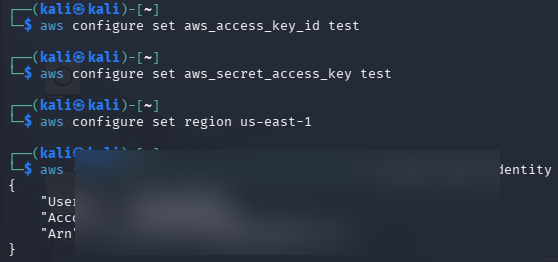
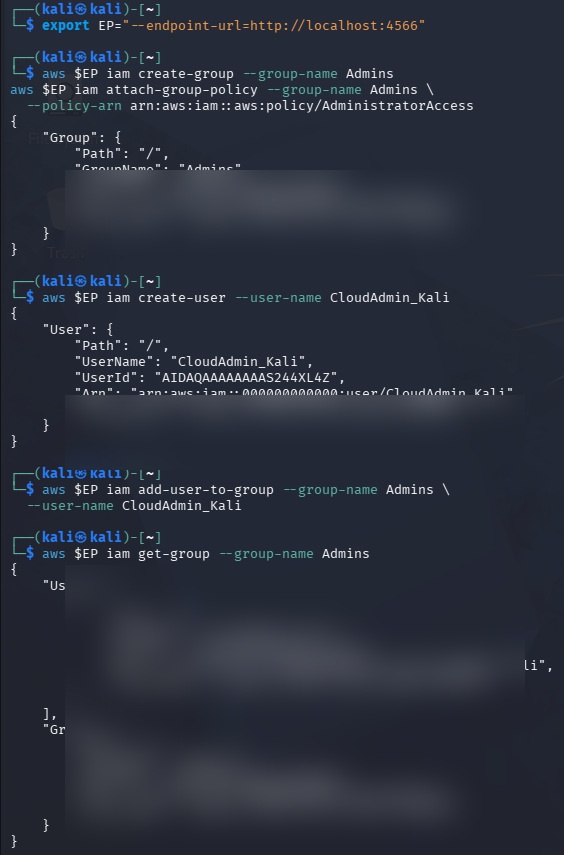
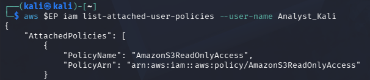
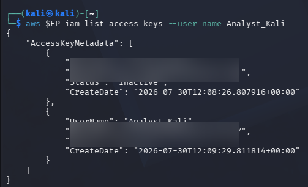
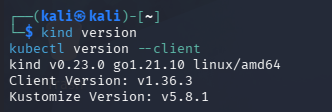
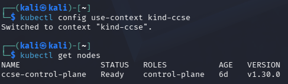
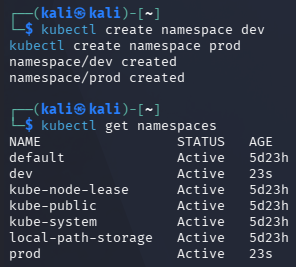
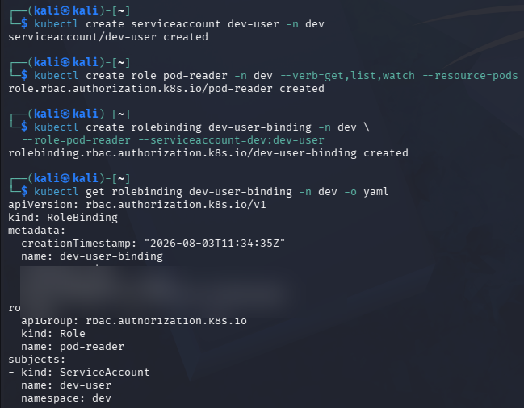
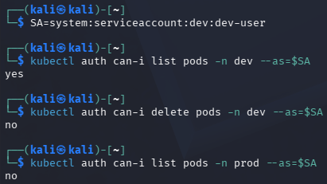

# **IKB42603 Lab 1 — Account Security and IAM**

## Objective

Implement and verify AWS IAM account-security controls with LocalStack, then apply and test least-privilege Kubernetes RBAC. This report follows the supplied **IKB42603_Lab1_Account_Security_and_IAM** guide.

## Learning Outcomes

By the end of this lab, the student can:

- Configure the AWS CLI to use a LocalStack endpoint and verify the active identity.
- Use IAM groups, managed policies, and user membership to administer access.
- Explain least privilege through the use of a read-only analyst policy and access-key review.
- Create Kubernetes namespaces, service accounts, roles, and role bindings.
- Verify namespace-scoped permissions with `kubectl auth can-i`.

## Environment

- AWS CLI configured with test credentials and region `us-east-1`.
- LocalStack available at `http://localhost:4566`.
- Docker, Kind, and `kubectl` installed for the Kubernetes section.
- Kind `v0.23.0` and kubectl client `v1.30.3`, as recorded in the evidence.

## Task 1 — Cloud Identity Landscape

| Concept | AWS term | Purpose |
| --- | --- | --- |
| All-powerful owner | Root user | The account owner identity with unrestricted control. It is used only for essential account-level tasks and not daily administration. |
| Human/app identity | IAM User | A permanent identity for a person or application that can receive credentials and specific permissions. |
| Permission bundle | IAM Policy | A document that defines which actions on which resources are allowed or denied. |
| Collection of users | IAM Group | A collection of IAM users that receives shared permissions through attached policies. |
| Temporary identity | IAM Role | An identity with permissions that is assumed temporarily by a user, application, or service without long-lived credentials. |

## Step-by-Step Implementation

## Part A — Configure and verify the LocalStack AWS CLI connection

1. Configure placeholder AWS credentials for the LocalStack environment:

   ```bash
   aws configure set aws_access_key_id test
   aws configure set aws_secret_access_key test
   aws configure set region us-east-1
   ```

2. Confirm that the CLI can authenticate against LocalStack:

   ```bash
   aws --endpoint-url=http://localhost:4566 sts get-caller-identity
   ```

   The result identifies the LocalStack account and root IAM ARN; the identifier is blurred in the submitted evidence.

   Evidence: [1.png](Evidence-redacted/1.png)

## Part B — Create an IAM administrators group and user

1. Save the LocalStack endpoint option in a shell variable:

   ```bash
   EP="--endpoint-url=http://localhost:4566"
   ```

2. Create an IAM group named `Admins`:

   ```bash
   aws $EP iam create-group --group-name Admins
   ```

3. Attach the AWS-managed `AdministratorAccess` policy to the group:

   ```bash
   aws $EP iam attach-group-policy --group-name Admins \
     --policy-arn arn:aws:iam::aws:policy/AdministratorAccess
   ```

4. Create the user `CloudAdmin_Kali`:

   ```bash
   aws $EP iam create-user --user-name CloudAdmin_Kali
   ```

5. Add the user to the `Admins` group and verify membership:

   ```bash
   aws $EP iam add-user-to-group --group-name Admins \
     --user-name CloudAdmin_Kali
   aws $EP iam get-group --group-name Admins
   ```

   The returned group data lists `CloudAdmin_Kali` as a member of `Admins`.

   Evidence: [2.png](Evidence-redacted/2.png)

## Part C — Review IAM least-privilege policy and access keys

1. List the managed policies attached to the `Analyst_Kali` user:

   ```bash
   aws $EP iam list-attached-user-policies --user-name Analyst_Kali
   ```

   The evidence confirms that `AmazonS3ReadOnlyAccess` is attached, granting read-only access to Amazon S3 rather than administrator permissions.

   Evidence: [3.png](Evidence-redacted/3.png)

2. Review the user's access keys:

   ```bash
   aws $EP iam list-access-keys --user-name Analyst_Kali
   ```

   The response shows one **Inactive** key and one **Active** key. This supports the access-key rotation practice: deactivate the old key after replacing it, then remove it once no longer needed.

   Evidence: [4.png](Evidence-redacted/4.png)

## Part D — Confirm Kubernetes command-line tools

1. Check the installed Kind and kubectl client versions:

   ```bash
   kind version
   kubectl version --client
   ```

   The recorded versions are Kind `v0.23.0` and kubectl client `v1.30.3`.

   Evidence: [5.png](Evidence-redacted/5.png)

## Part E — Kubernetes cluster status

1. Create or select the Kind cluster used for the lab:

   ```bash
   kind create cluster --name ccse
   ```

2. Check the cluster context and nodes:

   ```bash
   kubectl config use-context kind-ccse
   kubectl get nodes
   ```

### Recorded outcome

The `kind-ccse` context was selected successfully. The `ccse-control-plane` node is in the `Ready` state, confirming that the Kubernetes cluster is available for the RBAC tasks.

Evidence: [6.png](Evidence-redacted/6.png)

## Part F — Create development and production namespaces

1. Create separate namespaces for environment isolation:

   ```bash
   kubectl create namespace dev
   kubectl create namespace prod
   ```

2. Verify the namespaces:

   ```bash
   kubectl get namespaces
   ```

   Both `dev` and `prod` are shown as `Active`.

   Evidence: [7.png](Evidence-redacted/7.png)

## Part G — Apply least-privilege Kubernetes RBAC

1. Create a service account for development namespace access:

   ```bash
   kubectl create serviceaccount dev-user -n dev
   ```

2. Create a role that permits only `get`, `list`, and `watch` operations on pods in `dev`:

   ```bash
   kubectl create role pod-reader -n dev \
     --verb=get,list,watch --resource=pods
   ```

3. Bind the `dev-user` service account to that role:

   ```bash
   kubectl create rolebinding dev-user-binding -n dev \
     --role=pod-reader --serviceaccount=dev:dev-user
   ```

4. Inspect the binding:

   ```bash
   kubectl get rolebinding dev-user-binding -n dev -o yaml
   ```

   The binding references the `pod-reader` role and the `dev:dev-user` service account.

   Evidence: [8.png](Evidence-redacted/8.png)

## Part H — Verify effective permissions

1. Set the service-account identity:

   ```bash
   SA=system:serviceaccount:dev:dev-user
   ```

2. Test the allowed read action and two restricted actions:

   ```bash
   kubectl auth can-i list pods -n dev --as=$SA
   kubectl auth can-i delete pods -n dev --as=$SA
   kubectl auth can-i list pods -n prod --as=$SA
   ```

   Results:

   - Listing pods in `dev`: `yes`
   - Deleting pods in `dev`: `no`
   - Listing pods in `prod`: `no`

   These results demonstrate least privilege and namespace isolation.

   Evidence: [9.png](Evidence-redacted/9.png)

## Short-Answer Questions

### Q1. Why is attaching policies to groups better than attaching them directly to users?

Groups centralise permission management. An administrator changes the policy once on the group, and every member receives the same update. This is easier to audit, reduces inconsistent user permissions, and simplifies onboarding or removal of users.

### Q2. What is the difference between an IAM User and an IAM Role?

An IAM User is a long-term identity for a person or application and may use permanent credentials such as an access key. An IAM Role is assumed temporarily and provides temporary credentials. Roles are preferred for services and temporary access because they avoid distributing long-lived credentials.

### Q3. Explain least privilege using the Analyst account, and how it reduces blast radius if compromised.

The `Analyst_Kali` user has only `AmazonS3ReadOnlyAccess`, so it can read S3 content but cannot create, delete, or change cloud resources. If this account is compromised, an attacker is limited to the permissions of that account rather than receiving administrator control. This limits the blast radius: the scale of damage or unauthorised change is much smaller.

### Q4. In Kubernetes, what is the difference between a Role and a RoleBinding?

A Role defines permitted actions and resources within a namespace. In this lab, `pod-reader` allows `get`, `list`, and `watch` on pods in `dev`. A RoleBinding assigns that Role to an identity; `dev-user-binding` grants the `pod-reader` permissions to the `dev-user` service account.

### Q5. Why did the developer service account fail to access prod, and which security principle does that demonstrate?

The service account is bound to a namespaced Role in `dev` only. It has no Role or RoleBinding granting access in `prod`, so Kubernetes authorisation denies the request. This demonstrates least privilege and environment isolation through namespace-scoped RBAC.

### Authentication versus authorisation

The service account passes authentication because Kubernetes recognises the identity `system:serviceaccount:dev:dev-user`. Authorisation then checks its RoleBinding and Role rules. Listing pods in `dev` is allowed, while deleting pods and listing pods in `prod` are blocked because no rule grants those actions.

## Commands Used

```bash
aws configure set aws_access_key_id test
aws configure set aws_secret_access_key test
aws configure set region us-east-1
aws --endpoint-url=http://localhost:4566 sts get-caller-identity
aws $EP iam create-group --group-name Admins
aws $EP iam attach-group-policy --group-name Admins --policy-arn arn:aws:iam::aws:policy/AdministratorAccess
aws $EP iam create-user --user-name CloudAdmin_Kali
aws $EP iam add-user-to-group --group-name Admins --user-name CloudAdmin_Kali
aws $EP iam get-group --group-name Admins
aws $EP iam list-attached-user-policies --user-name Analyst_Kali
aws $EP iam list-access-keys --user-name Analyst_Kali
kind version
kubectl version --client
kind create cluster --name ccse
kubectl config use-context kind-ccse
kubectl get nodes
kubectl create namespace dev
kubectl create namespace prod
kubectl create serviceaccount dev-user -n dev
kubectl create role pod-reader -n dev --verb=get,list,watch --resource=pods
kubectl create rolebinding dev-user-binding -n dev --role=pod-reader --serviceaccount=dev:dev-user
kubectl auth can-i list pods -n dev --as=$SA
kubectl auth can-i delete pods -n dev --as=$SA
kubectl auth can-i list pods -n prod --as=$SA
```

## Screenshots

All screenshot links below point to redacted copies in `Evidence-redacted`. Account IDs, access-key IDs, Kubernetes resource IDs, and IP addresses have been blurred; the originals remain unchanged.

### Figure 1 — LocalStack AWS CLI identity verification



### Figure 2 — IAM administrators group, policy, user, and membership



### Figure 3 — Read-only policy attached to the analyst user



### Figure 4 — Analyst access-key status



### Figure 5 — Kind and kubectl client versions



### Figure 6 — Active Kubernetes context and ready control-plane node



### Figure 7 — Development and production namespaces



### Figure 8 — Service account, Role, RoleBinding, and verification output



### Figure 9 — RBAC authorisation results



## Challenges Encountered

- The guide uses the example name `ccse-lab1`, while the working evidence uses the cluster context `kind-ccse`.
- Selecting the actual context with `kubectl config use-context kind-ccse` resolved the naming mismatch before continuing with RBAC.

## Lessons Learned

- IAM groups make administrator permissions easier to manage than assigning the same policy to users individually.
- `AmazonS3ReadOnlyAccess` demonstrates least privilege by limiting the analyst to read-only S3 access.
- Access-key rotation should leave only the current key active and remove an old key after it is no longer required.
- Kubernetes Roles and RoleBindings are namespace-scoped; the `dev-user` can list pods in `dev` but cannot delete pods or list pods in `prod`.
- Evidence submitted for assessment should use redacted copies whenever it contains identifiers or network addresses.

## References

- IKB42603 Lab 1 guide: [IKB42603_Lab1_Account_Security_and_IAM.pdf](IKB42603_Lab1_Account_Security_and_IAM.pdf)
- AWS IAM documentation: <https://docs.aws.amazon.com/IAM/latest/UserGuide/introduction.html>
- Kubernetes RBAC documentation: <https://kubernetes.io/docs/reference/access-authn-authz/rbac/>

## Conclusion

The IAM evidence demonstrates an administrator group, a separately scoped read-only analyst policy, and key-state review. The Kubernetes evidence confirms a ready cluster, namespace separation, and RBAC that allows the development service account to read pods only within `dev`.
