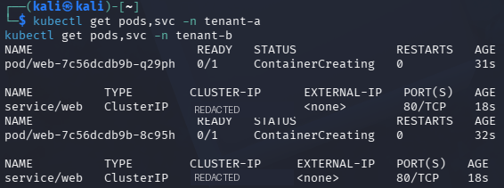
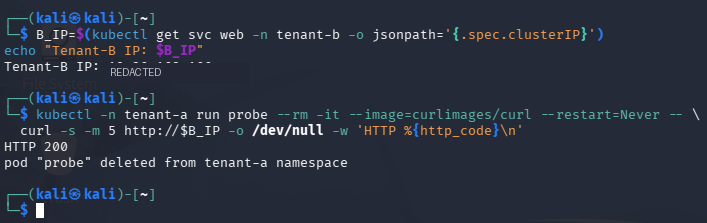
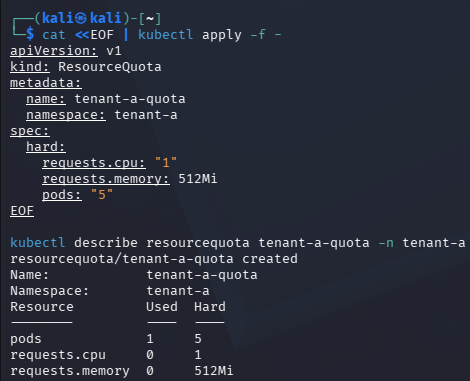
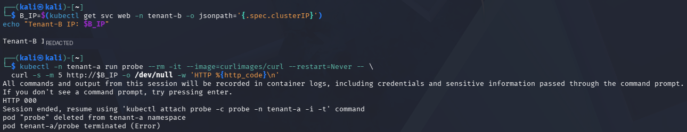
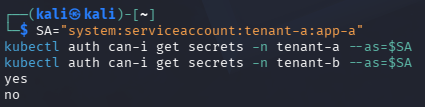
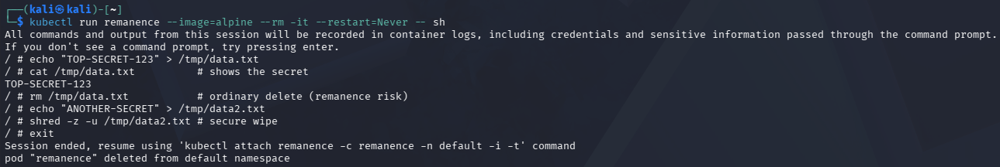

# IKB42603 Cloud Computing Security Essentials — Lab 2 Report

## Secure Isolation and Multi-Tenancy

| Student information | Details |
| --- | --- |
| Name | MUHAMMAD AMMAR ADLI BIN JAMIL |
| Student ID | 52215124188 |
| Group | L02-B04 |
| Lab | Lab 2 — Secure Isolation and Multi-Tenancy |

## Objective

To demonstrate and evaluate secure multi-tenancy in a shared Kubernetes environment by applying compute, network, and storage isolation controls. The lab shows that tenants may share the same underlying cloud infrastructure, but their workloads, network access, resources, and sensitive data must still be protected from one another. It specifically examines the default-open risk, resource quotas, NetworkPolicy enforcement, RBAC-protected secrets, and data remanence/secure deletion. The overall aim is to apply the principle of least privilege so each tenant receives only the access and resources required for its workload.

This objective is achieved by:

- Creating two separate tenant namespaces on one Kubernetes cluster.
- Testing the insecure default network behaviour before applying controls.
- Applying compute, network, and storage access controls and verifying their results.
- Evaluating secure deletion practices for sensitive data.

## Learning Outcomes

1. Separate tenant workloads with Kubernetes namespaces and container deployments, while recognising that they still share cluster infrastructure.
2. Demonstrate why default-open networking creates a multi-tenant security risk by testing traffic between the two tenants.
3. Block unauthorised cross-tenant traffic using a default-deny `NetworkPolicy` and verify the result using the same probe.
4. Enforce per-tenant secret access through RBAC and verify permissions using the service-account identity.
5. Explain data remanence and compare normal file deletion with secure deletion and cryptographic erasure.

## Environment and Tools

- Kubernetes cluster configured with the Calico CNI, which enforces Kubernetes NetworkPolicy rules.
- `kubectl` for creating and verifying namespaces, workloads, quotas, policies, and RBAC permissions.
- NGINX workloads representing tenant web applications and a `curlimages/curl` pod to test reachability.
- Docker/Alpine container commands and a volume for the data-remanence and secure-wipe exercise.

The work was completed in two stages: first, the default shared-cluster behaviour was observed; then, isolation controls were applied and their effect was verified.

The implementation sequence was:

1. Create the tenant workloads and services.
2. Demonstrate default cross-tenant connectivity.
3. Apply a resource quota to limit noisy-neighbour impact.
4. Apply default-deny ingress and repeat the connectivity test.
5. Verify secret access using the tenant-A service account.
6. Demonstrate normal deletion and secure wiping of sensitive data.

## Implementation and Evidence

### Task 1 — Two Tenants on One Cluster

Two tenants were modelled as separate namespaces: `tenant-a` and `tenant-b`. Each tenant received an NGINX deployment named `web` and a ClusterIP service on port 80. This arrangement represents two different customers using one Kubernetes cluster. Namespaces keep the tenants' Kubernetes resources organised and separated by name, while both workloads still use the same cluster infrastructure.

**Evidence and result:** Screenshot 1 shows separate `web` pods and ClusterIP services for both namespaces. At the time of capture, the pods were still in `ContainerCreating`; this confirms that the deployments and services had been created and Kubernetes was starting the containers. Once ready, each service provides an internal endpoint for its tenant application.

### Task 2 — Default-Open Risk

The ClusterIP address for `tenant-b`'s `web` service was obtained (redacted in this report). A probe running in `tenant-a` successfully connected to it and returned `HTTP 200`. The `HTTP 200` response confirms that the web service was reachable and accepted the request. This proves that, before a NetworkPolicy is applied, namespace separation alone does not block cross-tenant network traffic; additional network controls are required.

**Evidence and result:** Screenshot 2 records the successful `HTTP 200` response. It is retained as the before-control result for direct comparison with Task 4, where the same connection is denied.

### Task 3 — Resource Quota (Noisy-Neighbour Control)

A `ResourceQuota` named `tenant-a-quota` was applied to `tenant-a` with limits of one CPU request, 512 MiB memory request, and five pods. The quota output shows one pod in use and the configured hard limits. This helps prevent a noisy-neighbour situation, where one tenant creates too many workloads or consumes too much CPU and memory, reducing the resources available to other tenants on the shared cluster.

**Evidence and result:** Screenshot 3 confirms that `tenant-a-quota` was created. The hard limits shown are enforced at namespace level, so future resource requests by workloads in `tenant-a` are evaluated against the quota.

### Task 4 — Default-Deny Network Isolation

A default-deny ingress `NetworkPolicy` was applied to `tenant-b`. The policy selects all pods in that namespace and denies incoming traffic unless another policy explicitly permits it. The same probe from `tenant-a` was rerun against the tenant-B service (IP redacted) and returned `HTTP 000`, followed by a terminated/error result. This is the expected failure/timeout condition and demonstrates that cross-tenant ingress was blocked.

**Evidence and result:** Screenshot 4 records the failed `HTTP 000` request after the policy was applied. Comparing it with Task 2 proves that the cross-tenant path was blocked by the policy.

### Task 5 — Storage and Secret Isolation

The service account `system:serviceaccount:tenant-a:app-a` was assessed using `kubectl auth can-i`. It was permitted to get secrets in `tenant-a` (`yes`) but denied the same action in `tenant-b` (`no`). The role and role binding grant only the minimum required permission within tenant-A's namespace. This confirms that RBAC scope prevents a tenant-A workload identity from reading tenant-B secrets, even though both secrets are stored in the same Kubernetes cluster.

**Evidence and result:** Screenshot 5 shows both permission checks: `yes` for tenant-A's own namespace and `no` for tenant-B. This verifies that access depends on the requesting identity and namespace, not only on whether a secret exists.

### Task 6 — Data Remanence and Secure Deletion

The data-remanence exercise writes a sensitive value to a file, displays it, then removes it with a normal delete. This demonstrates that deletion does not necessarily mean the underlying data has been immediately erased. The screenshot also records the secure-wipe command `shred -u /tmp/data2.txt`, which overwrites then removes the second sensitive file. A normal delete only removes the filesystem reference, whereas secure overwriting reduces the chance that recoverable data remains on locally controlled storage. In cloud environments, destroying the encryption key is normally the more practical secure-deletion method.

**Evidence and result:** Screenshot 6 shows the sensitive test value, the normal removal command, and the `shred -u` secure-wipe command. The exercise illustrates the security principle; overwriting does not guarantee removal of every copy in cloud-managed storage.

## Short-Answer Questions

### Q1. Why can containers in different namespaces reach each other by default, and why is that dangerous in multi-tenant cloud?

Kubernetes namespaces are primarily logical partitions for names, policies, and access controls; they are not firewall boundaries by themselves. In the absence of a NetworkPolicy, Kubernetes networking normally allows pods to communicate across namespaces if they can address a service or pod. This is dangerous in a multi-tenant cloud because a compromised or malicious workload in one tenant can probe, connect to, or attack services belonging to another tenant. It can also expose internal application interfaces that were never intended for another customer. The `HTTP 200` result in Task 2 demonstrates this risk.

### Q2. Explain the default-deny principle and how your NetworkPolicy implements it.

Default-deny means traffic is rejected unless an explicit rule permits it. The policy in `tenant-b` selects every pod (`podSelector: {}`) and declares `Ingress` as the controlled traffic type, but supplies no allowed ingress peers or ports. Therefore, ingress to every selected tenant-B pod is denied. The follow-up probe returned `HTTP 000`, showing that the previously allowed cross-tenant request was blocked. This approach reduces attack surface because access is granted deliberately rather than assumed to be safe. Same-namespace access would require a separate explicit allow policy.

### Q3. How do virtual machines and containers differ in isolation strength? When would you add a VM boundary?

Containers isolate processes using operating-system mechanisms but share the host kernel. A container escape or kernel vulnerability can therefore affect the host or neighbouring containers. Virtual machines virtualise hardware and run separate guest kernels, providing a stronger boundary between workloads, although with more overhead in memory, storage, and start-up time. A VM boundary should be added for tenants with different trust levels, highly sensitive or regulated workloads, untrusted code, or whenever the impact of a shared-kernel compromise is unacceptable. Runtime sandboxes such as gVisor can provide an additional layer when full VMs are not practical.

### Q4. What is data remanence, and why is cryptographic erasure the preferred cloud solution?

Data remanence is residual information that remains recoverable after a user deletes a file or storage object. Normal deletion commonly removes metadata or a directory entry rather than immediately erasing underlying bytes. In cloud storage, customers generally do not control the physical disks, replicas, backups, snapshots, or blocks, so they cannot reliably overwrite every copy. Cryptographic erasure removes or destroys the encryption key, making all data encrypted with that key unreadable even if physical ciphertext remains; it is fast, scalable, and suitable for distributed cloud storage. It also allows a provider to retire access to data without relying on a physical-disk overwrite operation.

### Q5. Which of the three isolation dimensions (compute, network, storage) did each task exercise?

| Task | Isolation dimension(s) | Explanation |
| --- | --- | --- |
| Task 1 | Compute | Separates workloads into namespaces, creating the baseline tenant boundary. |
| Task 2 | Network | Demonstrates the default-open cross-namespace communication risk. |
| Task 3 | Compute | ResourceQuota restricts CPU, memory, and pod consumption to limit noisy-neighbour impact. |
| Task 4 | Network | Default-deny ingress policy blocks unauthorised cross-tenant traffic. |
| Task 5 | Storage | RBAC restricts access to each tenant's secrets and supports identity/access isolation. |
| Task 6 | Storage | Examines residual data and the need for secure deletion or cryptographic erasure. |

## Verification Summary

| Control | Result |
| --- | --- |
| Namespace separation | `tenant-a` and `tenant-b` workloads/services were created separately. |
| Default-open risk | `tenant-a` probe reached `tenant-b` service with `HTTP 200`. |
| Resource isolation | `tenant-a-quota` set CPU = 1, memory = 512 MiB, pods = 5. |
| Network isolation | After default-deny ingress, the same cross-tenant probe returned `HTTP 000`/failed. |
| Secret isolation | Tenant-A service account: `yes` in `tenant-a`, `no` in `tenant-b`. |
| Data remanence control | Normal deletion and `shred -u` secure-wipe procedure demonstrated. |

## Conclusion

The lab showed that namespaces provide useful workload separation but do not automatically provide complete tenant isolation. The successful pre-policy `HTTP 200` proved the default-open network risk, while the failed post-policy probe verified that default-deny filtering worked as intended. ResourceQuota addressed compute contention, and RBAC prevented cross-tenant secret access. Finally, the data-remanence exercise demonstrated why normal deletion is insufficient and why cryptographic erasure is preferred in cloud environments. Together, these controls provide defence in depth for secure Kubernetes multi-tenancy.

## References

1. IKB42603 Cloud Computing Security Essentials Lab Manual, Lab 2: *Secure Isolation and Multi-Tenancy*.
2. Kubernetes Documentation, *Network Policies*.
3. Calico Documentation, *Network Policy*.
