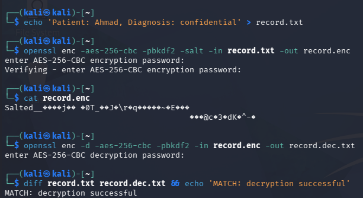
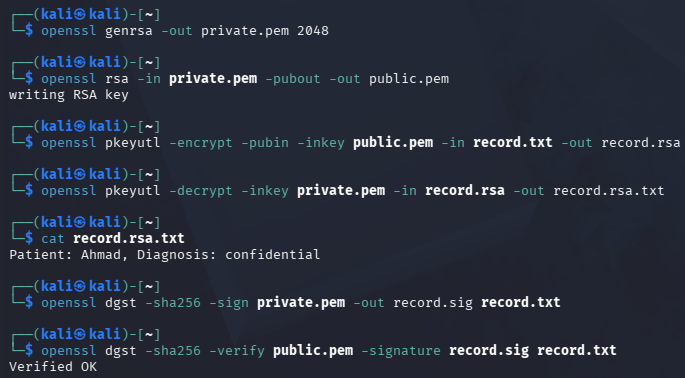
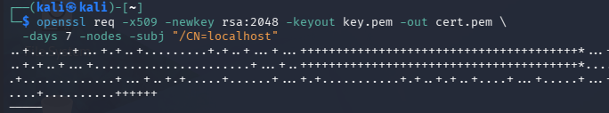
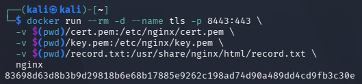
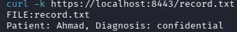
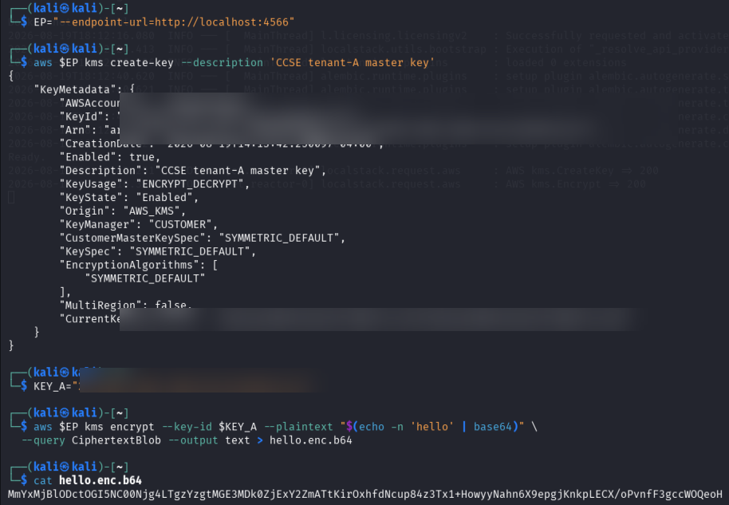
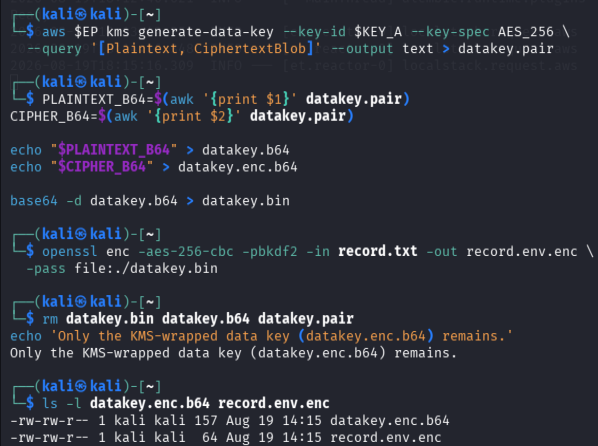
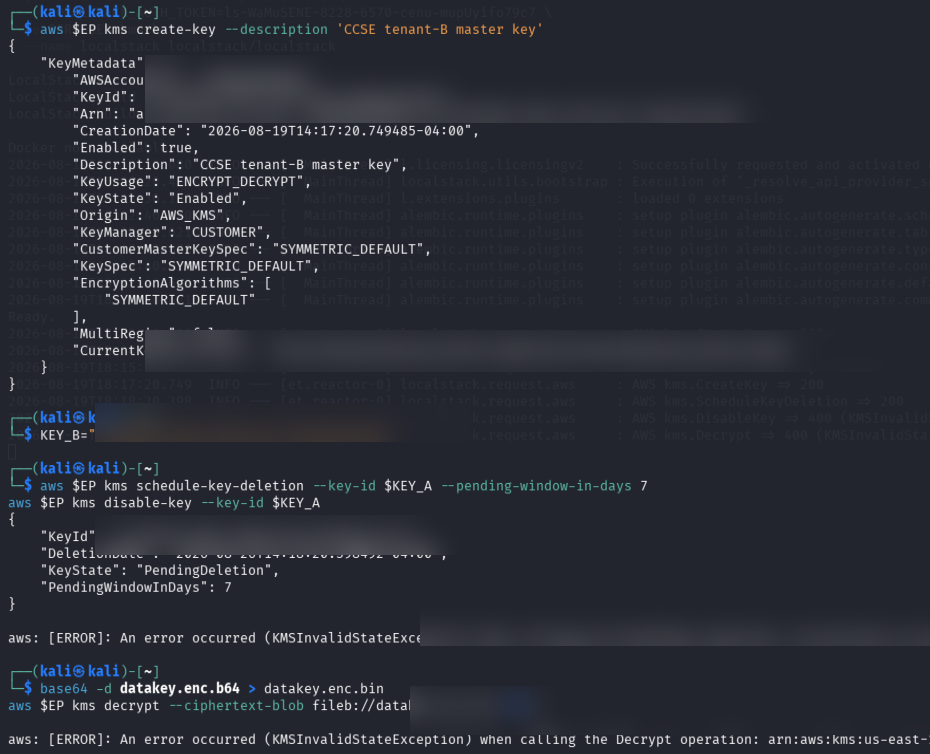
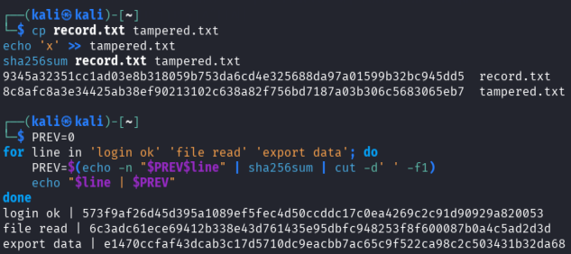

# Lab 3: Encryption and Key Management

| Item | Details |
|---|---|
| Student | MUHAMMAD AMMAR ADLI BIN JAMIL |
| Student ID | 52215124188 |
| Lab section | L02-B04 |
| Course | IKB42603 Cloud Computing Security Essentials |
| Lab topic | Data Protection: Encryption and Key Management |

## Tools Used

- **Kali Linux terminal:** Used to create files and execute the security commands.
- **OpenSSL:** Used for AES-256 encryption/decryption, RSA key generation, digital signatures, certificate creation and SHA-256 operations.
- **Docker and Nginx:** Used to run the local HTTPS server for the TLS demonstration.
- **cURL:** Used to request the protected record through the HTTPS endpoint.
- **AWS CLI v2:** Used to send KMS commands.
- **LocalStack:** Used as a local AWS-compatible KMS environment to create and manage keys without using a public cloud account.
- **Markdown:** Used to prepare this structured lab report and link the evidence screenshots.

## Learning Outcomes

After completing this lab, I am able to:

- Encrypt and decrypt stored data using AES-256 symmetric encryption.
- Generate RSA key pairs and use them for public-key encryption and digital-signature verification.
- Configure and test a TLS-protected HTTPS service to secure data in transit.
- Create and use KMS customer-managed keys through the AWS CLI and LocalStack.
- Implement envelope encryption using a KMS-wrapped data key and a temporary plaintext data key.
- Apply per-tenant key separation and explain cryptographic erasure.
- Verify data integrity with SHA-256 and use a hash chain to make log tampering detectable.

## Objective

This lab demonstrates how cloud data is protected throughout its lifecycle: while stored, while travelling across a network, and while the encryption keys are created, used and retired. The lab applies both confidentiality and integrity controls. Confidentiality is achieved through AES, RSA, TLS and KMS; integrity and authenticity are demonstrated using digital signatures, SHA-256 hashes and a hash-chained log.

The practical work uses OpenSSL to perform encryption, decryption, signing, verification and certificate creation. LocalStack KMS is then used as a local cloud-KMS environment to create tenant master keys, generate data keys, demonstrate envelope encryption and make encrypted data unrecoverable through cryptographic erasure. The overall aim is to show that encryption is effective only when keys are securely controlled, separated between tenants and destroyed when access must end.

> **Redaction note:** KMS account numbers, key IDs, ARNs and other private key identifiers are blurred in the evidence. The original screenshots are not altered.

## Task 1 — Symmetric Encryption (AES-256)

A sensitive record was encrypted with `openssl enc -aes-256-cbc -pbkdf2 -salt`. Displaying the encrypted file produced unreadable ciphertext. The file was then decrypted with the same passphrase, and `diff` returned `MATCH: decryption successful`, confirming that the original plaintext was recovered correctly.

The `-aes-256-cbc` option selects AES with a 256-bit key, while `-pbkdf2` derives a stronger encryption key from the passphrase. The random salt prevents identical plaintext encrypted with the same passphrase from producing the same ciphertext. The encrypted file cannot be meaningfully read without the correct passphrase.

**Key actions:**

- Created a sample sensitive record in `record.txt`.
- Encrypted the record to `record.enc` using AES-256-CBC.
- Confirmed the encrypted content was unreadable, then decrypted it to `record.dec.txt`.
- Compared the original and decrypted files; the `MATCH` result confirmed successful recovery.

**Commands used:**

```bash
echo 'Patient: Ahmad, Diagnosis: confidential' > record.txt
openssl enc -aes-256-cbc -pbkdf2 -salt -in record.txt -out record.enc
cat record.enc
openssl enc -d -aes-256-cbc -pbkdf2 -in record.enc -out record.dec.txt
diff record.txt record.dec.txt && echo 'MATCH: decryption successful'
```



**Result:** AES-256 protected the file at rest and successful decryption verified the integrity of the recovery process.

## Task 2 — Asymmetric Encryption and Digital Signatures

An RSA 2048-bit key pair was created. The public key encrypted the record and the private key decrypted it. The private key was then used to create a SHA-256 signature, which the public key verified successfully (`Verified OK`).

This task demonstrates two separate RSA uses. For confidentiality, a sender uses the recipient's public key and only the corresponding private key can recover the plaintext. For authenticity, the owner signs with the private key and anyone with the public key can validate the signature. Verification would fail if the file or signature were changed.

**Key actions:**

- Generated a 2048-bit RSA private key and derived its public key.
- Encrypted `record.txt` with `public.pem` and decrypted it with `private.pem`.
- Signed the record using SHA-256 and the private key.
- Verified the signature with the public key; the output was `Verified OK`.

**Commands used:**

```bash
openssl genrsa -out private.pem 2048
openssl rsa -in private.pem -pubout -out public.pem
openssl pkeyutl -encrypt -pubin -inkey public.pem -in record.txt -out record.rsa
openssl pkeyutl -decrypt -inkey private.pem -in record.rsa -out record.rsa.txt
openssl dgst -sha256 -sign private.pem -out record.sig record.txt
openssl dgst -sha256 -verify public.pem -signature record.sig record.txt
```



**Result:** Only the holder of the private key can decrypt data encrypted by the public key, while signature verification confirms the file's origin and integrity.

## Task 3 — Encryption in Transit with TLS

### 3.1 Generate a self-signed certificate

An RSA self-signed certificate for `localhost` was created for the HTTPS service.

The certificate binds the server name `localhost` to a public key for this local demonstration. Because it is self-signed rather than issued by a trusted certificate authority, clients do not trust it automatically; this is why the later test uses `curl -k`.

**Key actions:**

- Generated a new RSA key pair for the HTTPS server.
- Created a self-signed certificate valid for seven days.
- Set the certificate subject to `CN=localhost` for local testing.

**Command used:**

```bash
openssl req -x509 -newkey rsa:2048 -keyout key.pem -out cert.pem \
  -days 7 -nodes -subj '/CN=localhost'
```



### 3.2 Start the HTTPS container

An Nginx container was started with the certificate, private key and record mounted into the container. Port 8443 exposes the HTTPS service.

Nginx acts as the HTTPS server. When a client connects, TLS negotiates an encrypted session before application data such as `record.txt` is transferred. The certificate and key are mounted only to supply the server's TLS identity for the lab.

**Key actions:**

- Started an Nginx container named `tls`.
- Mapped host port 8443 to the container's HTTPS port 443.
- Mounted the certificate, private key and record file into the container.

**Command used:**

```bash
docker run --rm -d --name tls -p 8443:443 \
  -v $(pwd)/cert.pem:/etc/nginx/cert.pem \
  -v $(pwd)/key.pem:/etc/nginx/key.pem \
  -v $(pwd)/record.txt:/usr/share/nginx/html/record.txt \
  nginx
```



### 3.3 Retrieve the record over HTTPS

`curl -k https://localhost:8443/record.txt` returned the expected record over TLS. The `-k` option accepts the locally generated self-signed certificate for this lab only.

The successful response proves that the service is reachable through HTTPS. In a production environment, `-k` should not be used; the certificate must be trusted and validated. TLS prevents network eavesdroppers from reading or changing the record in transit.

**Key actions:**

- Requested the record through `https://localhost:8443/record.txt`.
- Used `-k` only to accept the self-signed lab certificate.
- Confirmed that the HTTPS server returned the expected file.

**Command used:**

```bash
curl -k https://localhost:8443/record.txt
```



**Result:** Although the server returns the plaintext to the authorised client, TLS encrypts the traffic while it crosses the network, preventing an on-path observer from reading it.

## Task 4 — KMS Master Key and Direct Encryption

LocalStack KMS was configured through the local endpoint. A customer-managed master key for tenant A was created, its identifier was assigned to `KEY_A`, and KMS encrypted a small secret. Identifiers in the output are redacted.

The key identifier tells KMS which customer-managed key must perform the operation. KMS returns ciphertext rather than exposing the master key itself. This models the normal cloud design where applications request cryptographic operations from KMS instead of storing sensitive master-key material locally.

**Key actions:**

- Set the LocalStack KMS endpoint in the `EP` variable.
- Created a customer-managed master key for tenant A.
- Saved the returned key identifier in `KEY_A`.
- Used KMS to encrypt a small Base64-encoded secret; sensitive identifiers are redacted in the evidence.

**Commands used:**

```bash
EP='--endpoint-url=http://localhost:4566'
aws $EP kms create-key --description 'CCSE tenant-A master key'
KEY_A=<REDACTED_KEY_ID>
aws $EP kms encrypt --key-id $KEY_A --plaintext "$(echo -n 'hello' | base64)" \
  --query CiphertextBlob --output text > hello.enc.b64
cat hello.enc.b64
```



**Result:** The master key is managed by KMS and is used to protect small secrets or, more commonly, data keys.

## Task 5 — Envelope Encryption

KMS generated an AES-256 data key. The plaintext data key was decoded temporarily and used locally to encrypt `record.txt` into `record.env.enc`. The plaintext files (`datakey.bin` and `datakey.b64`) were then removed, leaving only the KMS-wrapped data key and encrypted record.

KMS returns two versions of the same data key: a plaintext version for the short-lived local encryption operation and a ciphertext version encrypted by the master key. The plaintext version must be handled carefully and removed immediately after use. Later, an authorised application can send the wrapped version to KMS for unwrapping, use the recovered data key only in memory, and discard it again.

**Key actions:**

- Requested an AES-256 data key from KMS.
- Separated the plaintext and KMS-wrapped data-key values.
- Used the temporary plaintext key to encrypt `record.txt` into `record.env.enc`.
- Deleted the plaintext key files, retaining only the wrapped key and ciphertext.

**Commands used:**

```bash
aws $EP kms generate-data-key --key-id $KEY_A --key-spec AES_256 \
  --query '[Plaintext,CiphertextBlob]' --output text > datakey.pair
PLAINTEXT_B64=$(awk '{print $1}' datakey.pair)
CIPHER_B64=$(awk '{print $2}' datakey.pair)
echo "$PLAINTEXT_B64" > datakey.b64
echo "$CIPHER_B64" > datakey.enc.b64
base64 -d datakey.b64 > datakey.bin
openssl enc -aes-256-cbc -pbkdf2 -in record.txt -out record.env.enc \
  -pass file:./datakey.bin
rm datakey.bin datakey.b64
```



**Result:** Large data is encrypted locally with a short-lived data key, while KMS protects only the much smaller wrapped data key.

## Task 6 — Per-Tenant Keys and Cryptographic Erasure

A separate master key was created for tenant B. Tenant A's key was scheduled for deletion, after which the attempt to decrypt tenant A's wrapped data key returned `KMSInvalidStateException`. The command to disable the already-pending key also returned an expected invalid-state error. This confirms that the tenant A master key can no longer be used to unwrap the data key.

Using separate keys makes each tenant's protection boundary independent. A tenant B key cannot decrypt ciphertext wrapped by tenant A's key. Once tenant A's key enters the pending-deletion state, KMS rejects decryption, so the wrapped data key cannot be recovered and the envelope-encrypted record remains unreadable.

**Key actions:**

- Created a second customer-managed master key for tenant B.
- Scheduled deletion of tenant A's key using the minimum seven-day deletion window.
- Attempted to disable and use the pending-deletion key; KMS returned an invalid-state error.
- Attempted to decrypt tenant A's wrapped data key; KMS rejected the operation.

**Commands used:**

```bash
aws $EP kms create-key --description 'CCSE tenant-B master key'
KEY_B=<REDACTED_KEY_ID>
aws $EP kms schedule-key-deletion --key-id $KEY_A --pending-window-in-days 7
aws $EP kms disable-key --key-id $KEY_A
base64 -d datakey.enc.b64 > datakey.enc.bin
aws $EP kms decrypt --ciphertext-blob fileb://datakey.enc.bin 2>&1
```



**Result:** Tenant A's encrypted record becomes unrecoverable when its wrapping key is unavailable, while tenant B has a separate key boundary.

## Task 7 — Integrity and Tamper-Evident Logging

The SHA-256 hash of `record.txt` differed from the hash of a modified copy, proving that even a one-character modification changes the fingerprint. A simple hash chain was also created: each event's hash includes the previous hash.

SHA-256 generates a fixed-length fingerprint from file contents. It is computationally infeasible to change the file while retaining the same expected hash. In the chained log, the first record starts from an initial value; every later record combines its event text with the preceding hash, creating a dependency between the entire sequence of events.

**Key actions:**

- Calculated the SHA-256 hash of the original record.
- Appended a character to a copy of the record and calculated both hashes.
- Confirmed that the original and tampered files produced different hash values.
- Created a three-entry hash chain for `login ok`, `file read` and `export data`.

**Commands used:**

```bash
cp record.txt tampered.txt
echo 'x' >> tampered.txt
sha256sum record.txt tampered.txt

PREV=0
for line in 'login ok' 'file read' 'export data'; do
  PREV=$(echo -n "$PREV$line" | sha256sum | cut -d' ' -f1)
  echo "$line | $PREV"
done
```



**Result:** Hashing detects modifications, and the chain makes changes to earlier log entries detectable because all following hashes would no longer match.

## Short-Answer Questions

### Q1. Compare symmetric and asymmetric encryption: speed, key distribution, and typical use.

Symmetric encryption uses one shared secret key for both encryption and decryption. It is very fast and suitable for bulk data, such as disks, databases, backups and TLS session data. Its main difficulty is securely distributing the shared key to every authorised party; anyone who obtains it can decrypt the data.

Asymmetric encryption uses a public/private key pair. It is much slower, but the public key can be distributed openly; only the private key must remain secret. It is typically used for key exchange, identity, digital signatures and small data items. In practice, systems combine both methods: asymmetric cryptography establishes or protects a symmetric data key, then symmetric encryption protects the bulk data.

### Q2. Why is key management described as the weakest link, not the algorithm?

Modern algorithms such as AES-256 and RSA are strong when used correctly. Security fails if keys are exposed in source code, stored unencrypted, copied too widely, sent through an insecure channel, never rotated, or retained after access should end. An attacker does not need to break AES if they can steal its key. Key management controls—generation, access control, storage in KMS/HSM, rotation, auditing, backup and deletion—therefore determine whether encryption actually protects the data.

### Q3. Explain envelope encryption and why only the master key needs hardware-grade protection.

Envelope encryption uses a unique symmetric data key to encrypt the actual data locally. That data key is then encrypted (wrapped) by a KMS master key and stored alongside the ciphertext. To decrypt, KMS unwraps the data key for authorised use, and the application uses it briefly before discarding it.

The master key is small and reused only for wrapping/unwrapping keys, so it is practical to keep it in a hardened KMS or HSM with strict access controls and auditing. The potentially large data never needs to pass through that hardware, which improves performance and scalability while maintaining strong key protection.

### Q4. How does cryptographic erasure achieve provable deletion where overwriting cannot in the cloud?

Cryptographic erasure destroys or permanently disables the key required to decrypt ciphertext. Once the tenant's wrapping key is unavailable, its encrypted data key cannot be recovered and the underlying ciphertext is computationally useless. This works even when copies, snapshots, replicas or backups of the ciphertext remain.

Overwriting is weaker in cloud storage because the organisation may not control every physical replica, backup, cache or storage block, and it can be difficult to prove that every copy was overwritten. Destroying the sole decryption key gives a clear, auditable boundary: no surviving ciphertext copy is readable without the key.

### Q5. How does a hash chain make a log tamper-evident?

For each log entry, a hash is calculated from the previous hash and the current event. If an attacker modifies, removes or inserts an earlier entry, that entry's hash changes; every later link becomes inconsistent as well. A verifier can recompute the chain and identify the break.

A hash chain is tamper-evident rather than magically tamper-proof: an attacker who can rewrite the entire log and its final hash could forge a new chain. Storing or signing periodic chain heads in a separate trusted system makes such rewriting detectable and strengthens the log's integrity.

## Security Best-Practices Checklist

- [x] Data encrypted at rest with AES and decryption verified.
- [x] RSA keys used correctly: public key encryption and private key signing.
- [x] Data protected in transit using TLS.
- [x] Envelope encryption used and plaintext data-key files removed.
- [x] Separate tenant keys used and cryptographic erasure demonstrated.
- [x] File integrity checked with SHA-256 and a hash chain.

## Lessons Learned

This lab showed that encryption is not a single control; it is a complete process involving encryption algorithms, secure transport, key handling, access control and deletion. AES is efficient for protecting large files, but it depends completely on protecting and distributing the shared key safely. RSA solves the key-distribution and identity problem, although it is slower and is therefore normally combined with symmetric encryption rather than used for large files.

The TLS exercise demonstrated that HTTPS protects the same plaintext file while it travels over a network. A self-signed certificate is suitable for a controlled lab but should be replaced by a trusted certificate in a real deployment. I also learned that KMS improves security because applications can request encryption and decryption operations without directly storing the master key.

Envelope encryption was an important practical lesson: a data key encrypts the actual file, while KMS protects the data key with a master key. Removing plaintext data-key files immediately reduces the chance of exposure. Finally, tenant-specific keys and cryptographic erasure provide a strong deletion method in cloud environments, where overwriting every replica is difficult. SHA-256 and hash chains complement encryption by making unauthorised changes to data and logs visible.

## Conclusion

The lab showed a layered data-protection approach. AES protects stored data efficiently; RSA and signatures provide secure key use and authenticity; TLS protects traffic in transit; KMS enables scalable envelope encryption and tenant key boundaries; and hashing provides integrity and tamper evidence. Secure key lifecycle management is essential because encryption remains effective only while keys are protected and available solely to authorised users.
