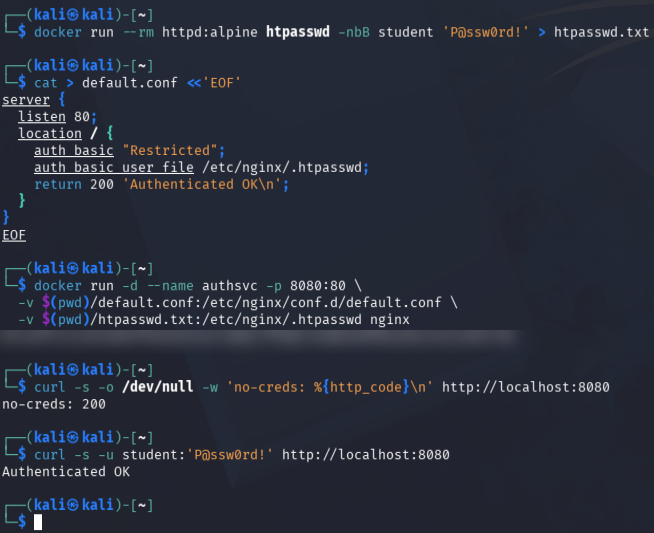
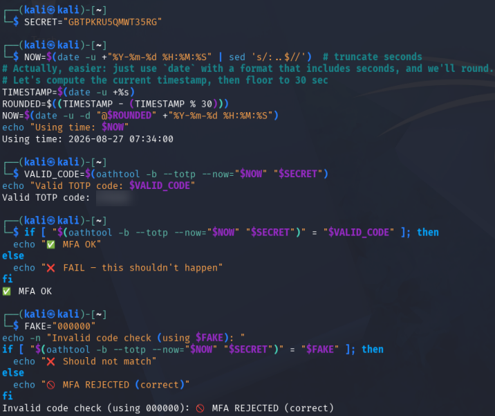
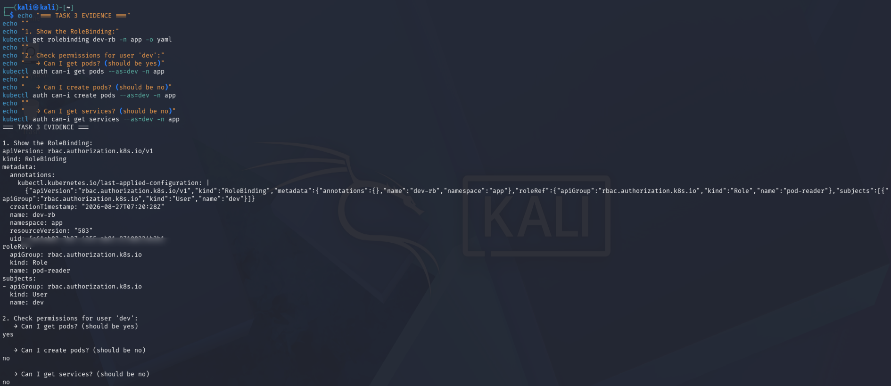
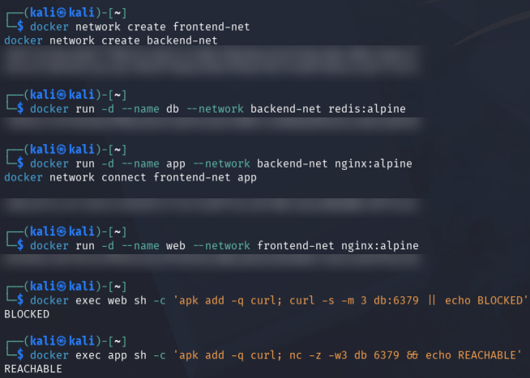
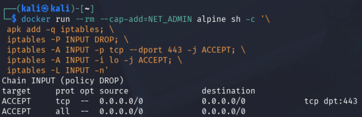
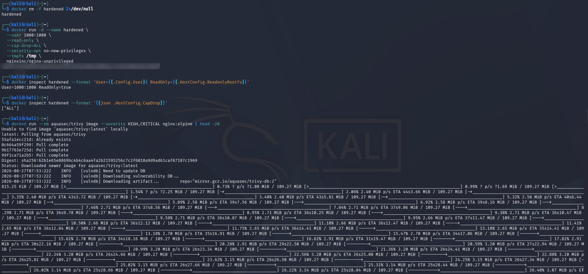
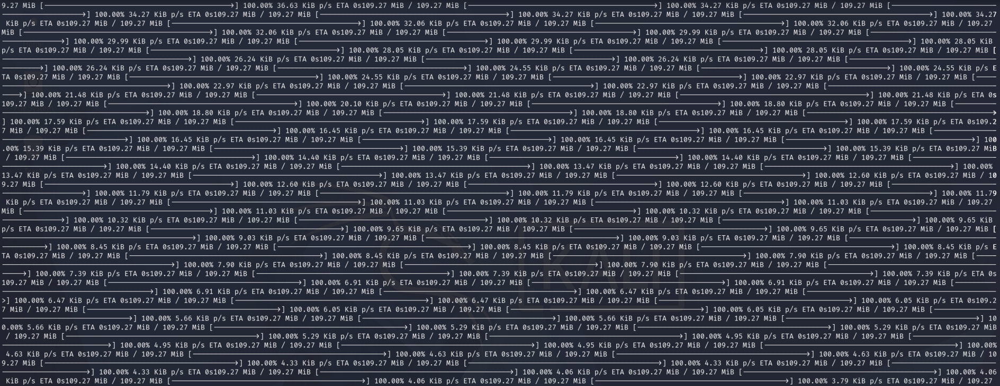
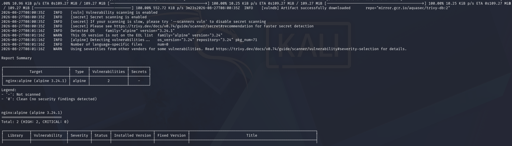

# IKB42603 Lab 4 — Access Control and Network Security

| Item | Details |
|---|---|
| Student | MUHAMMAD AMMAR ADLI BIN JAMIL |
| Student ID | 52215124188 |
| Lab | L02-B04 |
| Course | IKB42603 Cloud Computing Security Essentials |

## Objective

This lab builds a small, deliberately constrained cloud-style environment and applies defence in depth from the user request all the way to the host kernel. The objective is to verify that only identified users enter a service, that authenticated users receive only the permissions assigned to their role, and that a compromised workload cannot freely traverse the network or escalate privileges. The practical evidence must therefore demonstrate both positive and negative results: valid credentials succeed while anonymous requests fail; a valid TOTP succeeds while an invalid code fails; the developer can read pods but cannot perform administrative actions; the front tier is blocked from the database while the application tier is allowed through; the firewall denies unspecified ports; and the hardened container runs with a reduced operating-system attack surface. Together these controls protect confidentiality (limiting who can reach data), integrity (preventing unauthorized changes), and availability (reducing the blast radius of a compromised service).

## Learning Outcomes

1. Differentiate authentication (identity verification) from authorization (permission enforcement).
2. Generate and validate a time-based one-time password (TOTP) as a second authentication factor.
3. Enforce least-privilege access with Kubernetes RBAC.
4. Segment application tiers so only required service-to-service communication is possible.
5. Apply default-deny firewall policy and explicit allow rules.
6. Reduce container attack surface using non-root execution, immutable storage, dropped Linux capabilities, and vulnerability scanning.

## Environment

The supplied evidence was captured in a Kali Linux terminal. The lab uses Docker, Nginx, Redis, Kubernetes (`kind` and `kubectl`), `oathtool`, `iptables`, and Trivy. Docker networks used were `frontend-net` and `backend-net`; the Kubernetes namespace was `app`.

> Privacy note: all evidence embedded below uses non-destructive redacted copies. Docker/container identifiers, Kubernetes object UID, MFA shared secret, and OTP value are obscured. The original screenshots have not been altered.

## Step-by-Step Implementation

### Task 1 — Password-protected service (authentication)

An Nginx service was configured with HTTP Basic Authentication. A request without credentials returned `401`, proving that anonymous users were rejected. A request using the correct `student` credentials returned `Authenticated OK`, proving successful authentication.

This task isolates authentication from authorization: the service first checks the username/password pair before it returns any protected response. `htpasswd` stores a bcrypt password record, while the mounted Nginx configuration points `auth_basic_user_file` at that record. The two `curl` requests are an important control test—one confirms the deny path and one confirms the allow path. In production, HTTPS would be required so the Basic credentials cannot be observed in transit.

- **Credential store:** bcrypt entry for user `student`.
- **Protected endpoint:** Nginx listening on host port `8080`.
- **Negative test:** no credentials → HTTP `401`.
- **Positive test:** valid credentials → HTTP `200` and `Authenticated OK`.

```bash
docker run --rm httpd:alpine htpasswd -nbB student 'P@ssw0rd!' > htpasswd.txt

cat > default.conf <<'EOF'
server {
  listen 80;
  location / {
    auth_basic "Restricted";
    auth_basic_user_file /etc/nginx/.htpasswd;
    return 200 'Authenticated OK\n';
  }
}
EOF

docker run --rm -d --name authsvc -p 8080:80 \
  -v $(pwd)/default.conf:/etc/nginx/conf.d/default.conf \
  -v $(pwd)/htpasswd.txt:/etc/nginx/.htpasswd nginx
curl -s -o /dev/null -w 'no-creds: %{http_code}\n' http://localhost:8080
curl -s -u student:'P@ssw0rd!' http://localhost:8080
```

Result: `no-creds: 401` followed by `Authenticated OK`.



### Task 2 — TOTP multi-factor authentication

A base32 shared secret was enrolled/used to produce a six-digit TOTP. The evidence shows a valid TOTP comparison producing `MFA OK`; it also demonstrates that the invalid code `000000` is rejected. The secret and OTP have been redacted because both are security-sensitive.

TOTP adds a possession factor to the password factor. The generator and verifier independently calculate a short-lived code from the shared secret and the current time step. Comparing the code at the same timestamp prevents a race during testing; operational systems should also enforce a small clock-skew window, rate-limit attempts, and never print the secret or code to logs.

| Factor | Example in this task | Security value |
|---|---|---|
| Something you know | Password | Proves knowledge of the account secret |
| Something you have | Authenticator/TOTP secret | Requires access to the enrolled device |
| Verification result | `MFA OK` / rejection | Confirms both factors are checked |

```bash
# Standard lab method
SECRET=$(head -c20 /dev/urandom | base32)
echo "Enrol this secret in an authenticator app: $SECRET"
oathtool --totp -b "$SECRET"
read -p 'Enter the 6-digit code: ' CODE
[ "$CODE" = "$(oathtool --totp -b "$SECRET")" ] && echo 'MFA OK' || echo 'MFA FAILED'

# Reproducible verification method used in the evidence
NOW=$(date -u '+%Y-%m-%d %H:%M:%S')
VALID_CODE=$(oathtool -b --totp --now="$NOW" "$SECRET")
[ "$(oathtool -b --totp --now="$NOW" "$SECRET")" = "$VALID_CODE" ] && echo 'MFA OK' || echo 'MFA FAILED'
```

Result: valid code produced `MFA OK`; a deliberately incorrect code produced `MFA REJECTED (correct)`.



### Task 3 — RBAC authorization

RBAC was verified by querying permissions for `dev`. The evidence shows that `dev` can read pods but cannot create pods or read services. This demonstrates least privilege: authentication as `dev` does not grant unrestricted cluster access.

The Role and RoleBinding are namespace-scoped. The role grants only `get` and `list` on the `pods` resource, and the binding attaches those verbs to the developer identity. `kubectl auth can-i` asks the API server to perform an authorization decision without changing cluster state, making it a safe and repeatable proof of both allowed and denied operations. The YAML output also provides an auditable record of the subject, namespace, and referenced role.

| Check | Expected result | Meaning |
|---|---:|---|
| Get/list pods | `yes` | Required developer read access is present |
| Create pods/deployments | `no` | Workload modification is denied |
| Get services | `no` | Access outside the assigned resource is denied |

```bash
# Lab-manual service-account implementation
kind create cluster --name ccse-lab4
kubectl create namespace app
kubectl create serviceaccount dev -n app
kubectl create role dev-role -n app --verb=get,list --resource=pods
kubectl create rolebinding dev-rb -n app --role=dev-role --serviceaccount=app:dev
SA=system:serviceaccount:app:dev
kubectl auth can-i list pods -n app --as=$SA
kubectl auth can-i create deploy -n app --as=$SA
kubectl auth can-i delete pods -n app --as=$SA

# Verification commands shown in the supplied evidence
kubectl get rolebinding dev-rb -n app -o yaml
kubectl auth can-i get pods --as=dev -n app
kubectl auth can-i create pods --as=dev -n app
kubectl auth can-i get services --as=dev -n app
```

Result in evidence: `yes` for getting pods; `no` for creating pods and getting services.



### Task 4 — Three-tier network segmentation

Two Docker networks were created. `web` was attached only to `frontend-net`, `db` only to `backend-net`, and `app` was connected to both as the controlled intermediary. The front-end could not resolve/reach the database, while the application tier could reach it over Redis port 6379.

This is a three-tier trust boundary. Docker's embedded DNS and routing are network-scoped, so membership—not merely a container name—determines reachability. The failed `web` test demonstrates containment of a web-server compromise; the successful `app` test confirms that the required business path remains available. In a real deployment, the same idea would be implemented with private subnets, security groups, and database rules.

| Tier | Network attachment | Allowed relationship |
|---|---|---|
| Web/front end | `frontend-net` only | Reaches the application-facing network, not the database |
| Application | Both networks | Controlled bridge to the data tier |
| Database | `backend-net` only | Accepts traffic from the application tier |

```bash
docker network create frontend-net
docker network create backend-net
docker run -d --name db --network backend-net redis:alpine
docker run -d --name app --network backend-net nginx:alpine
docker network connect frontend-net app
docker run -d --name web --network frontend-net nginx:alpine
docker exec web sh -c 'apk add -q curl; curl -s -m 3 db:6379 || echo BLOCKED'
docker exec app sh -c 'apk add -q curl; nc -z -w3 db 6379 && echo REACHABLE'
```

Result: `web → db` was `BLOCKED`; `app → db` was `REACHABLE`.



### Task 5 — Default-deny firewall

An isolated container was given `NET_ADMIN` only to demonstrate firewall configuration. Its INPUT policy was changed to `DROP`, then TCP/443 and loopback traffic were explicitly permitted.

The order of operations matters: set the default policy first, then add narrowly scoped exceptions. Port 443 represents the intended secure service entry point, while loopback is needed for local processes. The command lists the resulting rules so the configuration can be inspected rather than assumed. On a host, equivalent rules should be managed persistently and tested from both permitted and prohibited source networks.

- Set `INPUT` policy to `DROP` (baseline deny).
- Allow only TCP destination port `443` (intended HTTPS service).
- Allow loopback (`lo`) for local host communication.
- List the rules to verify the effective policy.

```bash
docker run --rm --cap-add=NET_ADMIN alpine sh -c '\
  apk add -q iptables; \
  iptables -P INPUT DROP; \
  iptables -A INPUT -p tcp --dport 443 -j ACCEPT; \
  iptables -A INPUT -i lo -j ACCEPT; \
  iptables -L INPUT -n'
```

Result: the ruleset shows `Chain INPUT (policy DROP)` with only `tcp dpt:443` and loopback accepted.



### Task 6 — Container and host hardening

Nginx was launched as UID/GID `1000:1000` with a read-only root filesystem and all Linux capabilities dropped. `no-new-privileges` prevents privilege escalation, while a temporary in-memory `/tmp` gives the service only the writable space it requires.

Each option addresses a different post-compromise technique. Non-root execution limits access to host and container resources; read-only storage prevents many persistence and tampering actions; dropping every capability removes privileged kernel operations; and `no-new-privileges` prevents an executable from gaining additional rights. The tmpfs mount is an explicit exception for transient runtime files. `docker inspect` verifies the effective settings, and Trivy is the complementary supply-chain check for known vulnerable packages in the image.

| Control | Verification | Threat reduced |
|---|---|---|
| Non-root UID/GID | `User=1000:1000` | Root-level container compromise |
| Read-only root | `ReadOnly=true` | File tampering and persistence |
| Capability drop | `CapDrop=[ALL]` | Privileged kernel operations |
| No new privileges | Runtime security option | Setuid/setgid escalation |
| Trivy scan | HIGH/CRITICAL image scan | Known vulnerable packages |

```bash
docker run -d --name hardened \
  --user 1000:1000 \
  --read-only \
  --cap-drop=ALL \
  --security-opt no-new-privileges \
  --tmpfs /tmp \
  nginxinc/nginx-unprivileged

docker inspect hardened --format 'User={{.Config.User}} ReadOnly={{.HostConfig.ReadonlyRootfs}}'
docker inspect hardened --format '{{json .HostConfig.CapDrop}}'
docker run --rm aquasec/trivy image --severity HIGH,CRITICAL nginx:alpine | head -20
```

Result in evidence: `User=1000:1000 ReadOnly=true CapDrop=[ALL]`. A Trivy scan command is included above as required; no Trivy output screenshot was supplied, so no scan finding has been invented.

The complete Task 6 evidence is arranged as three focused images: the hardened container launch and inspection, followed by the Trivy image-scan output.







## Commands Used

The complete commands are documented under Tasks 1–6 above. The final verification and optional cleanup commands are:

```bash
kubectl get rolebinding dev-rb -n app -o yaml
docker inspect hardened --format '{{json .HostConfig.CapDrop}}'

docker rm -f authsvc db app web hardened 2>/dev/null
docker network rm frontend-net backend-net 2>/dev/null
kind delete cluster --name ccse-lab4
```

## Short-Answer Questions

### Q1. Authentication vs authorization

Authentication verifies **who** is making a request. In Task 1, HTTP Basic Authentication checks the submitted username and password: no credentials receive HTTP `401`, whereas the valid credentials receive `Authenticated OK`. Authorization determines **what an authenticated identity may do**. In Task 3, the `dev` identity is allowed to get/list pods but denied actions outside its role, such as creating pods or reading services.

### Q2. Why MFA is effective and attacks it defeats

MFA requires two independent factors: something the user knows (the password) and something the user has (the TOTP generator/authenticator). A stolen, guessed, reused, or phished password alone therefore cannot complete sign-in. MFA strongly reduces password-spraying, credential-stuffing, brute-force, and many phishing attacks. It is not absolute protection against a real-time phishing proxy or malware that steals session tokens, so users must still protect devices and verify login pages.

### Q3. How segmentation limits a compromised web server

The web tier shares only `frontend-net` with the application tier and has no route/DNS reachability to the database on `backend-net`. If an attacker compromises `web`, they cannot directly query Redis or move laterally into the database tier. They would need to compromise the controlled application tier as an additional step, reducing blast radius and providing another place to enforce controls and logging.

### Q4. Default-deny firewall policy and cloud security groups

Default deny blocks every inbound connection unless a specific rule permits it. Here, only TCP/443 and loopback traffic are allowed; accidental exposure of other ports is prevented by the baseline policy. Cloud security groups use the same allow-list model: inbound and outbound traffic should be explicitly approved for the required protocol, port, source, and destination rather than broadly opened.

### Q5. Hardening measures and the attack surface each removes

| Hardening measure | Attack surface reduced / attack blunted |
|---|---|
| `--user 1000:1000` | Limits impact of a process compromise; the service cannot use root privileges by default. |
| `--read-only` | Prevents modifying application files, installing tools, and many persistence attempts in the container filesystem. |
| `--cap-drop=ALL` | Removes privileged Linux kernel operations that a compromised process could otherwise misuse. |
| `--security-opt no-new-privileges` | Blocks gaining extra privileges through setuid/setgid binaries or similar mechanisms. |
| `--tmpfs /tmp` | Provides short-lived writable storage without making the image filesystem writable; contents disappear when the container stops. |
| Trivy image scan | Identifies known high/critical vulnerable packages so they can be updated or removed before deployment. |

## Challenges Encountered

1. TOTP values change every 30 seconds. For repeatable validation, the evidence uses a fixed timestamp during comparison; in normal use, both client and server clocks must remain synchronized.
2. Docker networking is intentionally isolated: `web` cannot reach `db` because they do not share a network. The `app` container provides the approved path between tiers.
3. Some tools/packages (for example `curl`, `nc`, `iptables`, `oathtool`, and Trivy) may not be present by default. They must be installed or run in the appropriate container/host environment.
4. The supplied Task 6 evidence verifies hardening settings but does not include a Trivy result. The scan command is recorded so the missing evidence can be captured without fabricating findings.

## Lessons Learned

1. Security is strongest when controls are layered: identity verification, authorization, network boundaries, and runtime hardening address different failure modes.
2. Authentication does not automatically imply broad access; RBAC applies least privilege after identity has been established.
3. Network segmentation contains lateral movement and keeps data services away from exposed tiers.
4. Default-deny rules are safer than permissive configurations because new exposure requires a conscious, auditable allow rule.
5. Running as non-root with an immutable filesystem and no unnecessary capabilities sharply reduces what a compromised container can do.
6. Vulnerability scanning must complement—not replace—secure configuration and timely patching.

## References

1. IKB42603 Cloud Computing Security Essentials Lab Manual, Lab 4: *Access Control & Network Security*.
2. [Docker Engine security documentation](https://docs.docker.com/engine/security/).
3. [Kubernetes RBAC authorization documentation](https://kubernetes.io/docs/reference/access-authn-authz/rbac/).
4. [CIS Benchmarks](https://www.cisecurity.org/cis-benchmarks).
5. [Cloud Security Alliance Security Guidance v5](https://cloudsecurityalliance.org/artifacts/security-guidance-v5).
6. [Trivy container-image scanning documentation](https://trivy.dev/latest/docs/target/container_image/).
