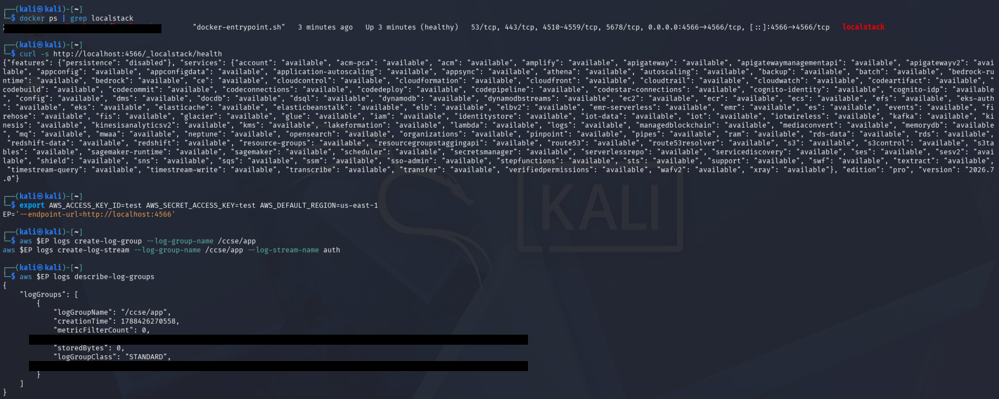
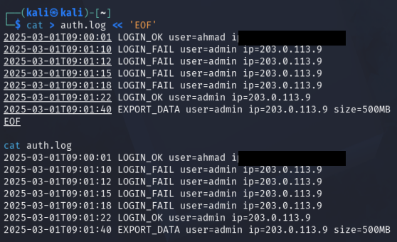
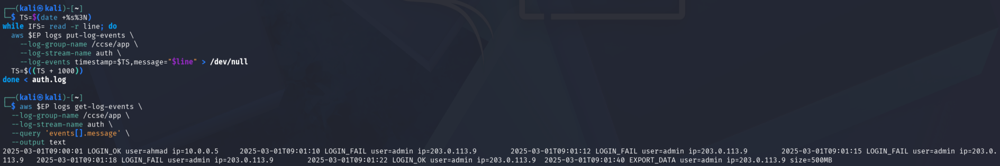
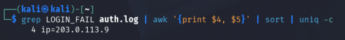
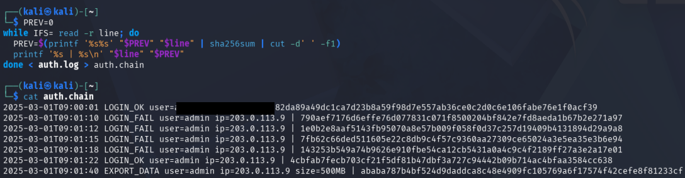
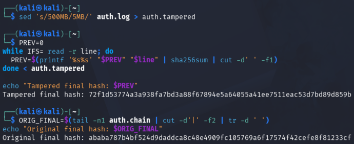
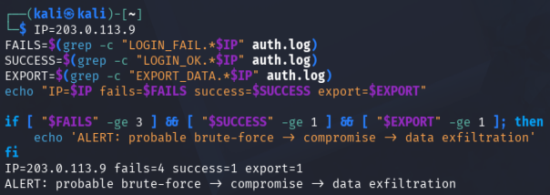
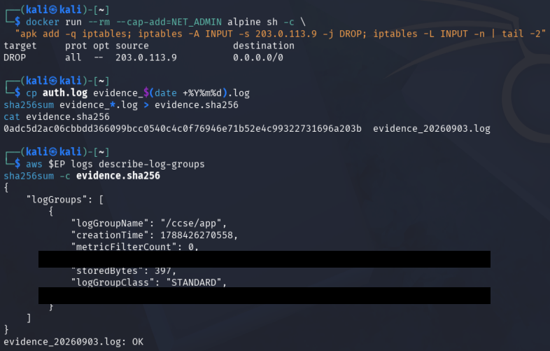

# IKB42603 Cloud Computing Security Essentials — Lab 5 Report

## Student Details

| Item | Details |
|---|---|
| Name | MUHAMMAD AMMAR ADLI BIN JAMIL |
| Student ID | 52215124188 |
| Lab Group | L02-B04 |
| Lab | Lab 5 — Monitoring, Logging and Incident Detection |

## Objective

The objective of this lab is to develop practical monitoring, logging, and incident-detection skills in a simulated cloud environment. The lab demonstrates how security-relevant application activity can be collected from an authentication log and centralised in a CloudWatch Logs-compatible service through LocalStack. Centralised logging improves visibility by keeping important records available for monitoring, investigation, and later audit rather than leaving them only on an individual host.

The lab also aims to show why log integrity is essential. A SHA-256 hash chain is used to make unauthorised changes to the log detectable: modifying one record changes the resulting chain hash and reveals that the original evidence has been altered. In addition, the lab applies event correlation to identify a suspicious sequence of repeated failed logins, a later successful login, and a large data export. This demonstrates how several low-level records can be combined into a meaningful incident alert.

Finally, the objective is to practise the main incident-response actions after detection: contain the suspected source, preserve a dated evidence copy, verify its integrity with a checksum, and document a clear incident timeline. These activities are completed using Docker, LocalStack, the AWS CLI, and standard command-line tools to connect cloud monitoring concepts with practical security operations.

## Learning Outcomes

At the end of this lab, I was able to:

1. Collect and centralise application telemetry in a CloudWatch Logs-compatible service.
2. Query logs to identify failed authentication activity and its source.
3. Produce a tamper-evident, hash-chained log and verify that a modification changes the chain hash.
4. Correlate several events into an incident alert indicating possible brute-force compromise and data exfiltration.
5. Contain the simulated source, preserve a hashed evidence copy, and document the incident response.

## Environment

| Component | Configuration / purpose |
|---|---|
| Host / terminal | Kali Linux shell |
| Container runtime | Docker |
| Cloud-service emulator | LocalStack, exposed on port 4566 |
| Central log service | CloudWatch Logs API emulated by LocalStack |
| Command-line client | AWS CLI v2 configured with test credentials and `us-east-1` |
| Supporting tools | `grep`, `awk`, `sort`, `uniq`, `sed`, `sha256sum`, `iptables` |
| Log group and stream | `/ccse/app` and `auth` |

All screenshot evidence reproduced in this report is a redacted copy. Private IP addresses and account-style identifiers shown in command output are covered with opaque black masks; commands themselves are left unchanged.

## Step-by-Step Implementation

### Initial setup — LocalStack and central log destination

LocalStack was started and its health endpoint was checked. The AWS CLI endpoint variable was then set so that CloudWatch Logs requests were sent to LocalStack rather than AWS. Finally, the `/ccse/app` log group and the `auth` stream were created.

```bash
docker run -d --name localstack -p 4566:4566 localstack/localstack
docker ps | grep localstack
curl -s http://localhost:4566/_localstack/health

export AWS_ACCESS_KEY_ID=test AWS_SECRET_ACCESS_KEY=test AWS_DEFAULT_REGION=us-east-1
EP='--endpoint-url=http://localhost:4566'

aws $EP logs create-log-group --log-group-name /ccse/app
aws $EP logs create-log-stream --log-group-name /ccse/app --log-stream-name auth
aws $EP logs describe-log-groups
```

The health response showed that LocalStack services were available, and `describe-log-groups` confirmed that `/ccse/app` was created. This provided the central destination required for the subsequent log events.

**Screenshot 1 — LocalStack health verification and CloudWatch log-group creation**



### Task 1 — Generate application logs

An authentication log was created containing one normal login, four consecutive failed logins from the same source, a later successful login from that source, and a large export operation. These records form the scenario used for detection and response.

```bash
cat > auth.log <<'EOF'
2025-03-01T09:00:01 LOGIN_OK    user=ahmad   ip=10.0.0.5
2025-03-01T09:01:10 LOGIN_FAIL  user=admin   ip=203.0.113.9
2025-03-01T09:01:12 LOGIN_FAIL  user=admin   ip=203.0.113.9
2025-03-01T09:01:15 LOGIN_FAIL  user=admin   ip=203.0.113.9
2025-03-01T09:01:18 LOGIN_FAIL  user=admin   ip=203.0.113.9
2025-03-01T09:01:22 LOGIN_OK    user=admin   ip=203.0.113.9
2025-03-01T09:01:40 EXPORT_DATA user=admin   ip=203.0.113.9 size=500MB
EOF

cat auth.log
```

The resulting log clearly records the timing and sequence needed to distinguish ordinary activity from suspicious activity.

**Screenshot 2 — Task 1: generated `auth.log` authentication and export events**



### Task 2 — Centralise logs in CloudWatch Logs

Each line in `auth.log` was sent as a separate log event. A timestamp was incremented by one second for each event to preserve their order. The events were then read back from the central store.

```bash
TS=$(date +%s000)
while IFS= read -r line; do
  aws $EP logs put-log-events \
    --log-group-name /ccse/app \
    --log-stream-name auth \
    --log-events timestamp=$TS,message="$line" >/dev/null
  TS=$((TS + 1000))
done < auth.log

aws $EP logs get-log-events \
  --log-group-name /ccse/app \
  --log-stream-name auth \
  --query 'events[].message' \
  --output text
```

The read-back output matched the locally generated events. This demonstrates centralisation: the application records are available in a separate logging service, where they can be queried and retained for operational monitoring or investigation.

**Screenshot 3 — Task 2: log events shipped to and retrieved from the central store**



### Task 3 — Query security-relevant activity

The log was filtered for failed logins. `awk` selected the user and source fields, while `sort` and `uniq -c` grouped identical values and counted them.

```bash
grep LOGIN_FAIL auth.log | awk '{print $4, $5}' | sort | uniq -c
```

The query returned **4** failures for the same source (`ip=203.0.113.9`). A log is the durable event record, whereas an event-driven detection could turn this result into a near-real-time alert, for example: “four failed logins from one IP.”

**Screenshot 4 — Task 3: failed-login count grouped by source IP**



### Task 4 — Tamper-proof logs with a hash chain

Each log entry was chained to the hash of the preceding entry. The first entry begins with `PREV=0`; each next SHA-256 value is calculated from the previous hash plus the current log line. The result is written into `auth.chain`.

```bash
PREV=0
while IFS= read -r line; do
  PREV=$(printf '%s%s' "$PREV" "$line" | sha256sum | cut -d' ' -f1)
  printf '%s | %s\n' "$line" "$PREV"
done < auth.log > auth.chain

cat auth.chain
```

To validate tamper detection, the export size was altered from `500MB` to `5MB`. The chained hash was recalculated from the altered log and compared with the final hash from the original chain.

```bash
sed 's/500MB/5MB/' auth.log > auth.tampered

PREV=0
while IFS= read -r line; do
  PREV=$(printf '%s%s' "$PREV" "$line" | sha256sum | cut -d' ' -f1)
done < auth.tampered

echo "Tampered final hash: $PREV"

ORIG_FINAL=$(tail -n1 auth.chain | cut -d'|' -f2 | tr -d ' ')
echo "Original final hash: $ORIG_FINAL"
```

The final hashes were different. Therefore, the modified `auth.tampered` file cannot be presented as the original chain: changing even one field propagates to the final hash and exposes the alteration.

**Screenshot 5 — Task 4: original hash-chained log**



**Screenshot 6 — Task 4: altered export record produces a different final hash**



### Task 5 — Detect the incident through correlation

The incident rule correlated three conditions for the same source: at least three failed logins, at least one later successful login, and at least one data export. This is stronger than examining any individual line in isolation.

```bash
IP=203.0.113.9
FAILS=$(grep -c "LOGIN_FAIL.*$IP" auth.log)
SUCCESS=$(grep -c "LOGIN_OK.*$IP" auth.log)
EXPORT=$(grep -c "EXPORT_DATA.*$IP" auth.log)
echo "IP=$IP fails=$FAILS success=$SUCCESS export=$EXPORT"

if [ "$FAILS" -ge 3 ] && [ "$SUCCESS" -ge 1 ] && [ "$EXPORT" -ge 1 ]; then
  echo 'ALERT: probable brute-force -> compromise -> data exfiltration'
fi
```

The result was `fails=4`, `success=1`, and `export=1`, which triggered the alert. The correlated timeline indicates a likely brute-force attempt, successful account compromise, then a large data export.

**Screenshot 7 — Task 5: correlation rule triggers the compromise and exfiltration alert**



### Task 6 — Incident response: contain and collect evidence

The simulated source was contained using a temporary container with `NET_ADMIN`, which added a DROP rule for the source IP. An evidence copy of the original log was created with a date-based filename, and its SHA-256 checksum was stored in `evidence.sha256` to support later integrity verification.

```bash
docker run --rm --cap-add=NET_ADMIN alpine sh -c \
  'apk add -q iptables; iptables -A INPUT -s 203.0.113.9 -j DROP; iptables -L INPUT -n | tail -2'

cp auth.log evidence_$(date +%Y%m%d).log
sha256sum evidence_*.log > evidence.sha256
cat evidence.sha256

aws $EP logs describe-log-groups
sha256sum -c evidence.sha256
```

The output confirmed that the DROP rule was present. The evidence checksum was generated and later verified with `OK`, confirming that the preserved evidence file had not changed since hashing. The central log group was still available as an additional investigation source.

**Screenshot 8 — Task 6: containment rule, evidence hash, central log availability and integrity check**



## Incident Report

### Analysis

The `admin` account received four failed login attempts from `203.0.113.9` between 09:01:10 and 09:01:18. At 09:01:22, the same source successfully logged in as `admin`. At 09:01:40, the account performed an `EXPORT_DATA` action of 500 MB. This sequence is consistent with a successful brute-force attack followed by probable data exfiltration.

### Detection

The detection used correlation rather than a single event: the same IP had at least three failures, then a successful login, then a data export. The rule produced the message: `ALERT: probable brute-force -> compromise -> data exfiltration`.

### Containment

The suspicious source was blocked in the simulation by adding an `iptables` INPUT DROP rule in an isolated container. In production, this action should be applied at the appropriate network-control point (security group, firewall, WAF, or host firewall) and should be accompanied by credential reset and session revocation for the affected account.

### Evidence & Integrity

The original `auth.log` was copied to a timestamped evidence file. A SHA-256 checksum was recorded in `evidence.sha256`, and `sha256sum -c evidence.sha256` returned `OK`. The `/ccse/app` central log group was also retained as a second source of the relevant events.

### Lesson Learned

The investigation shows why centralised, tamper-evident logs and correlation are essential. A failed login alone is normally low-confidence, but the ordered combination of repeated failures, a success, and a large export justified prompt containment. For stronger assurance, final hash-chain values should be stored separately in an append-only destination so an attacker cannot rewrite both the log and the integrity record.

### Incident Timeline

| Time | Event | Interpretation |
|---|---|---|
| 09:01:10–09:01:18 | Four `LOGIN_FAIL` events for `admin` from the same source | Possible credential guessing / brute-force activity |
| 09:01:22 | `LOGIN_OK` for `admin` from the same source | Possible successful compromise |
| 09:01:40 | `EXPORT_DATA` of 500 MB | Possible data exfiltration |
| Response | Source DROP rule applied; evidence copied and hashed | Containment and preservation |

## Short-Answer Questions

### Q1. What is the difference between a log and an event? Give an example of each from this lab.

A **log** is a durable, timestamped record of something that happened. In this lab, `2025-03-01T09:01:10 LOGIN_FAIL user=admin ...` is a log record retained in `auth.log` and centralised in `/ccse/app`. An **event** is a meaningful occurrence or detection signal derived from one or more records and used to trigger action. For example, the alert *“probable brute-force -> compromise -> data exfiltration”* is an event raised after the rule correlated four failures, one success, and one export. Logs provide the underlying evidence; events prioritise it for response.

### Q2. Why must audit logs be tamper-proof, and how does a hash chain achieve this?

Audit logs must be tamper-evident so investigators, auditors, and system owners can trust that the recorded sequence has not been silently altered to hide activity or create false evidence. In the hash chain, each record's SHA-256 value is calculated from the previous hash plus the current log line. Changing one line changes that record's hash and every later hash, including the final hash. The lab proved this when changing the export size from `500MB` to `5MB` produced a different final hash. A separate trusted or append-only store is still needed for the final hash or chain, otherwise an attacker with full access could replace both files.

### Q3. How did correlation detect an incident that no single log line revealed?

No single entry was conclusive: one failed login can be a normal user mistake, a successful login can be legitimate, and an export can be authorised. Correlation joined these events by the same source and evaluated their sequence and counts: four failures met the threshold of three, a later success indicated possible compromise, and a subsequent 500 MB export indicated possible impact. Together, the pattern produced a higher-confidence alert that justified containment and evidence collection.

### Q4. List the incident-response steps you performed and the goal of each.

| Step | Action performed | Goal |
|---|---|---|
| Detect | Queried failed logins and correlated failures, success, and export activity. | Identify a credible security incident and establish the affected account/source. |
| Analyse | Reviewed the timestamps, account, source, and export size. | Understand the sequence and assess likely compromise and impact. |
| Contain | Added a simulated `iptables` DROP rule for the suspicious source. | Stop further requests from that source while investigation continues. |
| Collect evidence | Copied `auth.log` to a dated evidence file; retained centralised logs. | Preserve the original records for investigation and reporting. |
| Verify integrity | Generated and checked `evidence.sha256`; compared original and tampered chain hashes. | Demonstrate that evidence has not changed and that log tampering is detectable. |
| Document | Recorded the detection logic, timeline, response, and lesson learned. | Provide an accountable record for follow-up, audit, and improvement. |

### Q5. How do the same logs serve both security monitoring and compliance evidence?

For security monitoring, the centralised records can be queried and correlated to detect failed logins, suspicious account use, and potential exfiltration quickly. For compliance, the same timestamped records demonstrate that activities were logged, retained, investigated, and protected against undetected modification. The evidence copy, SHA-256 verification, hash chain, and documented response provide an audit trail showing both what occurred and how its integrity was checked. Retention periods, access controls, and separate append-only storage would further strengthen their compliance value.

## Improved Incident-Response Assessment

The detection is assessed as a **probable** account-compromise and data-exfiltration incident, not a confirmed attribution. The failed attempts occurred from 09:01:10 to 09:01:18, followed by a successful login at 09:01:22 and a 500 MB export at 09:01:40. This sequence is suspicious because repeated authentication failures can indicate credential guessing, while a successful login and a large export immediately afterwards may indicate compromise and impact. The source used in this lab, `203.0.113.9`, is a documentation-only address rather than a live production address.

Recommended production follow-up actions are:

- Reset the affected `admin` credential and revoke active sessions or access tokens.
- Check export object records, account activity, and surrounding authentication logs to determine the scope.
- Block the source at the appropriate enforcement point, such as a firewall, security group, or WAF.
- Preserve host, cloud-audit, and application evidence before making broad remediation changes.

## Challenges Encountered

1. **Preserving event order during ingestion.** CloudWatch-style log events require timestamps; this was addressed by assigning an initial millisecond timestamp and increasing it by 1,000 milliseconds per event.
2. **Identifying a meaningful security signal.** A single failed login is common and not necessarily malicious. Correlating repeated failures, success, and a high-volume export produced a more reliable conclusion.
3. **Proving log integrity after modification.** A normal text log can be edited without visible evidence. The hash chain caused the final checksum to differ after the export size was changed.
4. **Preserving evidence without changing it.** The evidence copy was separated from the working log and hashed immediately, allowing its integrity to be verified later.

## Lessons Learned

1. Centralised logs improve visibility and provide an independent source for investigation.
2. Logs are durable records; detection rules turn related log events into actionable alerts.
3. Hash chains make unauthorised modification detectable, but the chain or final hash must also be retained in a separate append-only or trusted location.
4. Incident response should prioritise containment and evidence preservation before broad remediation changes can overwrite useful artefacts.
5. Correlation is essential: the full sequence of failures, success and export revealed the severity of the incident.

## References

1. Musa, S. (2026). *IKB42603 Cloud Computing Security Essentials: Lab 5 — Monitoring, Logging & Incident Detection*. UniKL MIIT Lab Manual.
2. Amazon Web Services. *AWS CLI Command Reference: CloudWatch Logs*. https://docs.aws.amazon.com/cli/latest/reference/logs/
3. LocalStack. *CloudWatch Logs documentation*. https://docs.localstack.cloud/aws/services/logs/
4. National Institute of Standards and Technology. *Computer Security Incident Handling Guide (SP 800-61 Rev. 2)*. https://csrc.nist.gov/pubs/sp/800/61/r2/final
