# IKB42603 Lab 6: Object Storage Security & the Data Security Lifecycle

| Student | Details |
|---|---|
| Name | MUHAMMAD AMMAR ADLI BIN JAMIL |
| Student ID | 52215124188 |
| Lab group | L02-B04 |
| Platform | Amazon S3 on LocalStack |

> **Redaction note.** Sensitive identifiers, signed URLs, bucket-specific values, key identifiers, and patient content have been covered by solid black redaction in the evidence images. Commands below retain variables/placeholders so they remain complete and safely reproducible.

## Objective

To configure and assess secure object storage through the complete data security lifecycle: classify objects, demonstrate and remediate public exposure, apply least-privilege access controls, use SSE-KMS encryption, delegate short-lived access, manage versioned data, apply lifecycle retention, and demonstrate cryptographic erasure.

## Learning Outcomes

Upon completing this lab, I can:

- Classify data before storage and select controls proportionate to sensitivity.
- Explain and test S3 resource policies, IAM identity policies, explicit deny, and Block Public Access.
- Configure bucket-default SSE-KMS encryption and explain its limits.
- Use presigned URLs, versioning, delete markers, lifecycle rules, and KMS key deletion appropriately.
- Collect evidence suitable for an audit of object-storage security controls.

## Environment

The lab used Kali Linux, Docker, LocalStack Pro with `ENFORCE_IAM=1`, AWS CLI v2, and `curl`. The AWS CLI was configured for the LocalStack endpoint `http://localhost:4566` and region `us-east-1`. The S3 bucket name and KMS key ID are redacted in evidence. LocalStack was used as an emulator; where it does not enforce an AWS control, the report distinguishes the observed result from real AWS behaviour.

## Environment Setup

Before beginning Task 1, I removed any previous LocalStack container, started a clean LocalStack Pro instance with IAM enforcement enabled, configured the AWS CLI test credentials and region, then ran `sts get-caller-identity`. This establishes that all later S3, IAM, and KMS commands target the isolated LocalStack environment rather than a real AWS account. The authentication token and identity values are black-redacted in the screenshot.

```bash
docker rm -f localstack
docker run -d --name localstack -p 4566:4566 \
  -e LOCALSTACK_AUTH_TOKEN="$LOCALSTACK_AUTH_TOKEN" \
  -e ENFORCE_IAM=1 localstack/localstack-pro:latest
export EP='--endpoint-url=http://localhost:4566'
aws configure set aws_access_key_id test
aws configure set aws_secret_access_key test
aws configure set region us-east-1
aws $EP sts get-caller-identity
```

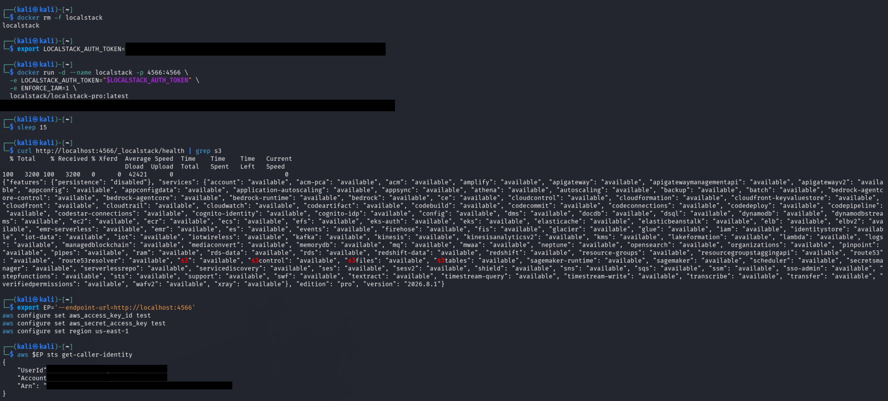

## Task 1 — Data Classification Before Storage

### Implementation and result

I created a patient-records bucket and stored three objects under deliberately scoped key prefixes. Each object was tagged before access decisions were considered. The object listing and confidential-object tag confirm the objects and classification tag.

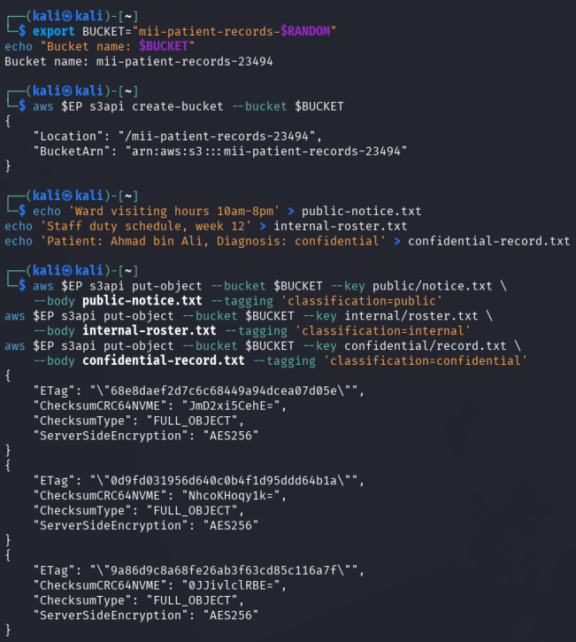

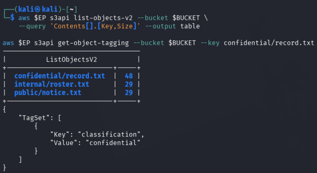

| Classification | Who may read it | Impact if leaked | Control applied |
|---|---|---|---|
| Public | Any intended public audience | Low; may cause misinformation if altered | Separate `public/` prefix; classification tag; integrity review |
| Internal | Authorised hospital staff | Operational disruption and staff privacy impact | Least-privilege prefix policy and short-lived presigned sharing |
| Confidential | Explicitly authorised clinical personnel only | Severe privacy, legal, and patient-safety impact | `confidential/` prefix, Block Public Access, explicit deny, SSE-KMS, versioning, lifecycle retention |

### Commands used

```bash
export BUCKET="miit-patient-records-$RANDOM"
aws $EP s3api create-bucket --bucket "$BUCKET"
aws $EP s3api put-object --bucket "$BUCKET" --key public/notice.txt --body public-notice.txt --tagging 'classification=public'
aws $EP s3api put-object --bucket "$BUCKET" --key internal/roster.txt --body internal-roster.txt --tagging 'classification=internal'
aws $EP s3api put-object --bucket "$BUCKET" --key confidential/record.txt --body confidential-record.txt --tagging 'classification=confidential'
aws $EP s3api list-objects-v2 --bucket "$BUCKET" --query 'Contents[].[Key,Size]' --output table
aws $EP s3api get-object-tagging --bucket "$BUCKET" --key confidential/record.txt
```

The slash in an S3 key is a prefix convention rather than a directory. This matters because policies must grant only the intended prefix; using `/*` would expose all keys.

This task shows that data protection begins with knowing what data is being stored. Classification allows the organisation to apply stronger controls to the confidential record than to a public notice, and prevents treating every object as equally safe to share.

## Task 2 — Reproduce the Public-Bucket Breach

### Implementation and result

I attached a policy granting `s3:GetObject` to `Principal: "*"`, then fetched the confidential object anonymously. The request returned HTTP 200, proving that a single public resource-policy principal was sufficient to expose the object. The patient content is black-redacted in the report evidence.

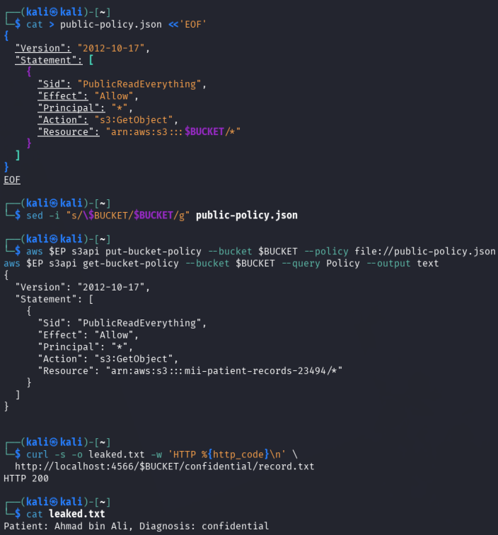

### Commands used

```bash
cat > public-policy.json <<JSON
{"Version":"2012-10-17","Statement":[{"Sid":"PublicReadEverything","Effect":"Allow","Principal":"*","Action":"s3:GetObject","Resource":"arn:aws:s3:::$BUCKET/*"}]}
JSON
aws $EP s3api put-bucket-policy --bucket "$BUCKET" --policy file://public-policy.json
curl -s -o leaked.txt -w 'HTTP %{http_code}\n' "http://localhost:4566/$BUCKET/confidential/record.txt"
```

The single exposure-causing element was `"Principal": "*"`. In a bucket policy it grants every principal, including anonymous internet callers, direct access to that resource. An over-broad IAM policy is still harmful, but is attached to a bounded identity population rather than all unauthenticated callers.

This demonstration is important because no technical exploit was required: the breach was caused entirely by an unsafe authorisation decision. It illustrates why bucket-policy review is a high-priority cloud-security activity.

## Task 3 — Remediate with Block Public Access and Least Privilege

### Implementation and result

I removed the public policy and enabled all four Block Public Access (BPA) flags. Evidence confirms that the configuration was stored with all values set to `true`.

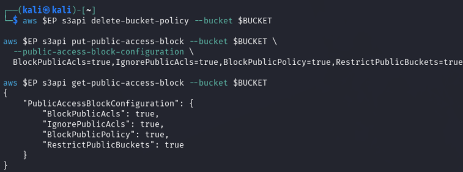

When the public policy was re-applied, LocalStack accepted it and the anonymous request still returned HTTP 200. This is a documented emulator limitation, not a secure production result. In AWS, `BlockPublicPolicy=true` rejects public bucket policies, while `RestrictPublicBuckets=true` restricts access made public by a policy. `BlockPublicAcls` and `IgnorePublicAcls` similarly prevent or disregard public ACLs. BPA is preventative: it stops unsafe configuration from taking effect; a detective control only identifies the exposure after it exists.

I then used a resource policy scoped to `internal/*` and to the account principal instead of `*`.

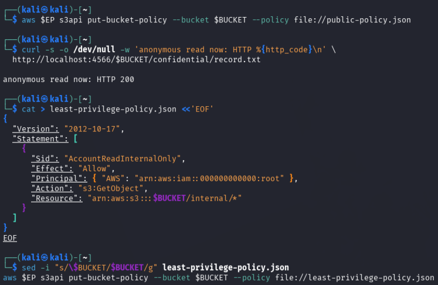

### Commands used

```bash
aws $EP s3api delete-bucket-policy --bucket "$BUCKET"
aws $EP s3api put-public-access-block --bucket "$BUCKET" --public-access-block-configuration \
  BlockPublicAcls=true,IgnorePublicAcls=true,BlockPublicPolicy=true,RestrictPublicBuckets=true
aws $EP s3api get-public-access-block --bucket "$BUCKET"
aws $EP s3api put-bucket-policy --bucket "$BUCKET" --policy file://public-policy.json
curl -s -o /dev/null -w 'anonymous read now: HTTP %{http_code}\n' "http://localhost:4566/$BUCKET/confidential/record.txt"
```

This task combines corrective and preventative protection. Removing the policy corrects the current exposure; BPA prevents a future administrator or automated deployment from making the bucket public by mistake. The scoped replacement policy then follows least privilege by granting only the internal prefix, rather than every object in the bucket.

## Task 4 — Identity Policy versus Resource Policy

### Implementation and result

The `DataAnalyst` IAM policy allowed reading objects, but the bucket policy explicitly allowed `internal/*` and explicitly denied `confidential/*`. The analyst successfully read the internal roster and was denied the confidential record. Sensitive principal identifiers are black-redacted.

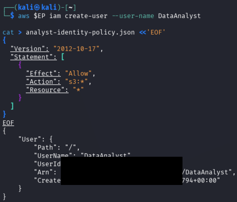

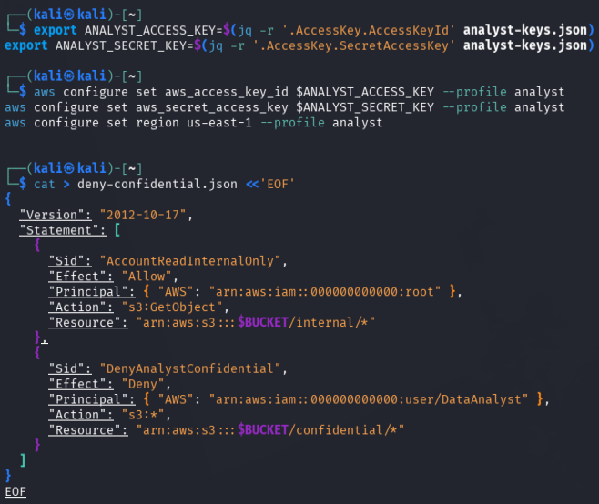

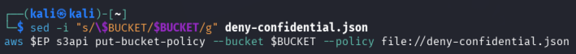

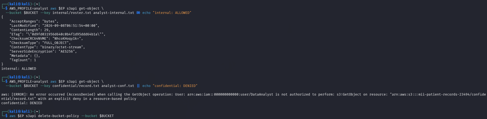

An identity-based policy is attached to a caller (user, group, or role); a resource-based policy is attached to the bucket and names permitted/denied principals. Evaluation proceeds from default deny, then explicit deny, then allow. For the internal request, `AllowAnalystInternal` and the analyst IAM allow supported access. For the confidential request, `DenyAnalystConfidential` decided the outcome because explicit deny always overrides every allow.

The result proves that permissions are not decided by the broadest allow alone. A resource owner can protect a sensitive prefix even where an identity policy is mistakenly too broad, provided the bucket policy contains a correctly scoped explicit deny.

### Commands used

```bash
aws $EP iam create-user --user-name DataAnalyst
aws $EP iam put-user-policy --user-name DataAnalyst --policy-name S3ReadAll --policy-document file://analyst-iam.json
aws $EP s3api put-bucket-policy --bucket "$BUCKET" --policy file://deny-confidential.json
AWS_PROFILE=analyst aws $EP s3api get-object --bucket "$BUCKET" --key internal/roster.txt analyst-internal.txt
AWS_PROFILE=analyst aws $EP s3api get-object --bucket "$BUCKET" --key confidential/record.txt analyst-conf.txt
```

## Task 5 — Default Encryption at Rest (SSE-KMS)

### Implementation and result

I created a dedicated KMS key and configured the bucket to use `aws:kms` by default, with bucket keys enabled. Uploads can therefore be encrypted even if the uploader omits encryption parameters. The KMS identifier is redacted.

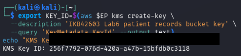

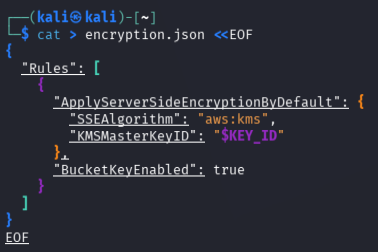

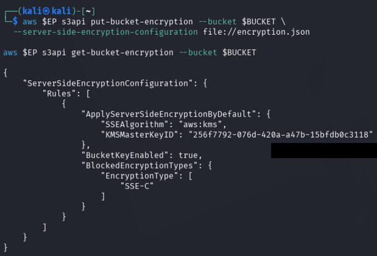

### Commands used

```bash
export KEY_ID=$(aws $EP kms create-key --description 'IKB42603 Lab6 patient records bucket key' --query 'KeyMetadata.KeyId' --output text)
aws $EP s3api put-bucket-encryption --bucket "$BUCKET" --server-side-encryption-configuration file://encryption.json
aws $EP s3api put-object --bucket "$BUCKET" --key confidential/record-v2.txt --body confidential-record.txt
aws $EP s3api head-object --bucket "$BUCKET" --key confidential/record-v2.txt --query '[ServerSideEncryption,SSEKMSKeyId,BucketKeyEnabled]' --output text
```

SSE-KMS protects object data at rest and lets KMS authorise key use. It does **not** prevent an otherwise authorised analyst from reading decrypted data through S3; authorisation needs IAM/bucket policies, BPA, and correct key permissions.

The bucket-default setting is stronger than relying on individual upload commands because it removes the opportunity for a developer to accidentally upload an unencrypted object. Bucket keys retain the same confidentiality model while reducing repeated KMS requests.

## Task 6 — Presigned URLs and the SecureTransport Condition Trap

### Implementation and result

I generated a 60-second presigned URL for the internal roster. It worked initially. LocalStack returned HTTP 200 after the nominal expiry; this is an emulator limitation. The URL contains `X-Amz-Expires=60`, which limits validity, and a signature binding the request parameters and signing identity. Anyone who holds the URL before it expires is authorised for its specified operation; it must be treated like a temporary bearer credential.

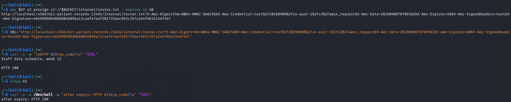

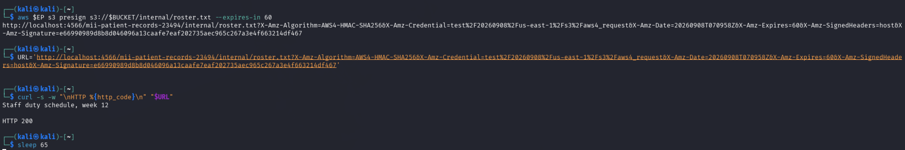

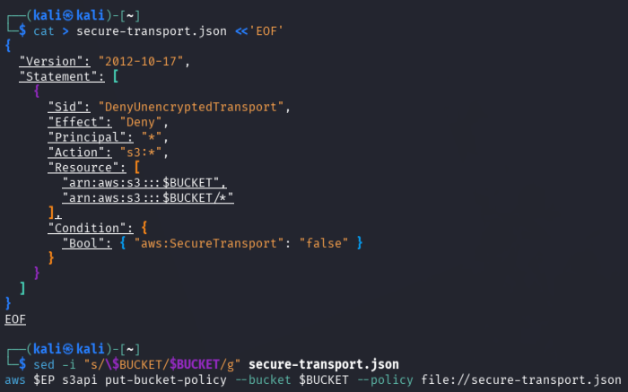

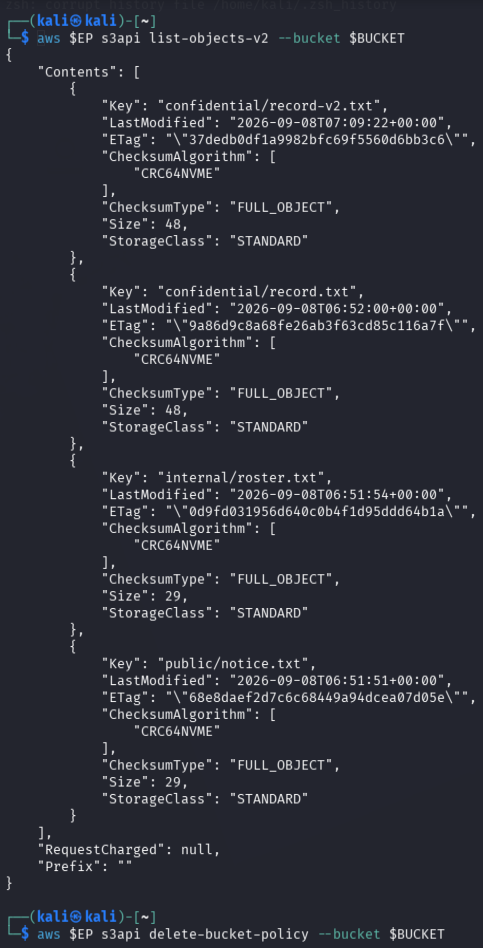

I also applied a policy denying `aws:SecureTransport=false`. Because the lab endpoint uses HTTP, LocalStack treated ordinary calls as insecure. The policy was then removed to recover access. The condition is correct for AWS HTTPS endpoints, but policy conditions must be tested against the actual environment.

This task demonstrates two different risks: a presigned URL is convenient but becomes a temporary bearer credential if copied or logged, while a policy condition can unintentionally deny legitimate activity if the environment does not meet its assumptions. Short expiry and HTTPS are both required controls.

### Commands used

```bash
aws $EP s3 presign "s3://$BUCKET/internal/roster.txt" --expires-in 60
curl -s -w 'HTTP %{http_code}\n' "$URL"
sleep 65
curl -s -o /dev/null -w 'after expiry: HTTP %{http_code}\n' "$URL"
aws $EP s3api put-bucket-policy --bucket "$BUCKET" --policy file://secure-transport.json
aws $EP s3api list-objects-v2 --bucket "$BUCKET"
aws $EP s3api delete-bucket-policy --bucket "$BUCKET"
```

## Task 7 — Versioning, Delete Markers, and Data Remanence

### Implementation and result

I enabled versioning, uploaded revised records, and deleted the current key. The operation added a delete marker rather than destroying history. An ordinary retrieval failed, but specifying the old `null` version retrieved the original record, proving object-level data remanence. The recovered clinical text and version IDs are black-redacted.

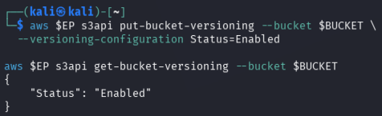

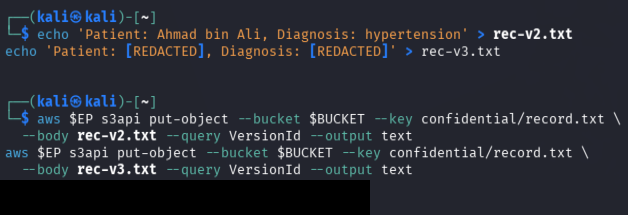

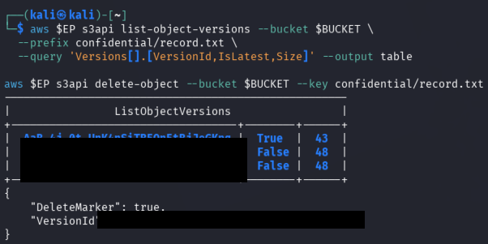

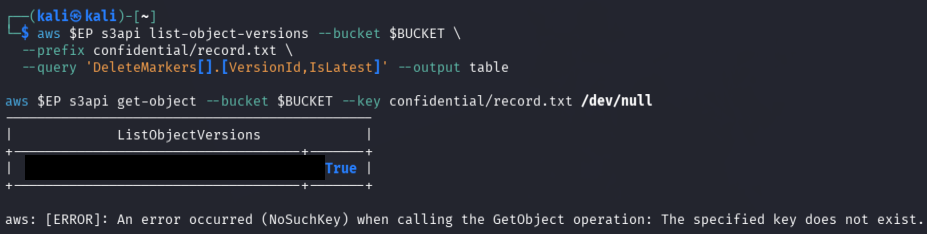

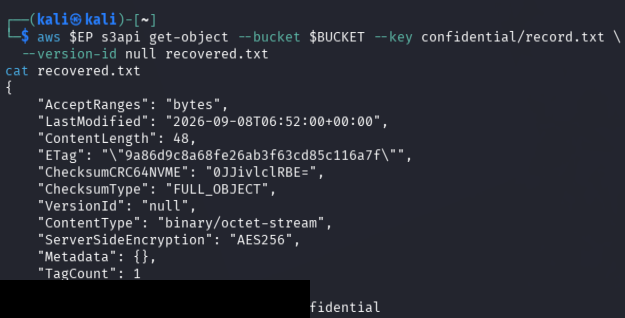

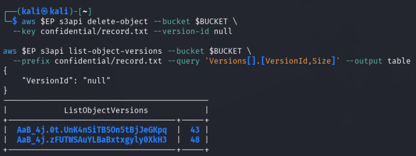

### Commands used

```bash
aws $EP s3api put-bucket-versioning --bucket "$BUCKET" --versioning-configuration Status=Enabled
aws $EP s3api put-object --bucket "$BUCKET" --key confidential/record.txt --body rec-v2.txt
aws $EP s3api put-object --bucket "$BUCKET" --key confidential/record.txt --body rec-v3.txt
aws $EP s3api delete-object --bucket "$BUCKET" --key confidential/record.txt
aws $EP s3api list-object-versions --bucket "$BUCKET" --prefix confidential/record.txt
aws $EP s3api get-object --bucket "$BUCKET" --key confidential/record.txt --version-id null recovered.txt
aws $EP s3api delete-object --bucket "$BUCKET" --key confidential/record.txt --version-id null
```

`delete-object` alone is not sufficient for an erasure request because it creates a marker and leaves old versions available. Provable deletion requires deleting every version/delete marker by version ID, and/or cryptographic erasure by disabling then scheduling deletion of the KMS key that protects the ciphertext.

Versioning improves recovery from accidental deletion and overwrites, but it changes the meaning of “delete.” Teams handling personal data must inventory non-current versions and delete markers when responding to a valid erasure request, rather than assuming that the current object view represents physical removal.

## Task 8 — Lifecycle, Retention, and Cryptographic Erasure

### Implementation and result

I applied enabled lifecycle rules for confidential-record retention and public-notice expiration. The configuration creates an auditable, automated retention process. I then scheduled the KMS key for deletion; its final state was `PendingDeletion`, which is evidence of cryptographic-erasure initiation.

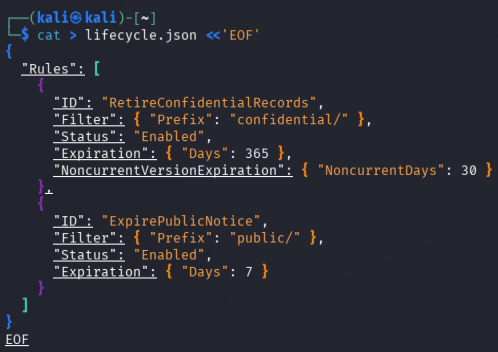

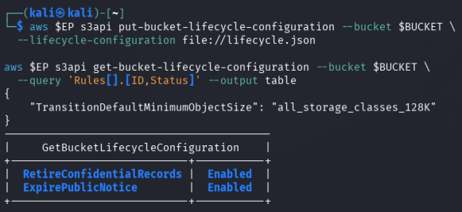

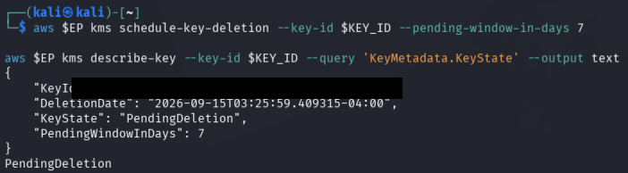

### Commands used

```bash
aws $EP s3api put-bucket-lifecycle-configuration --bucket "$BUCKET" --lifecycle-configuration file://lifecycle.json
aws $EP s3api get-bucket-lifecycle-configuration --bucket "$BUCKET" --query 'Rules[].[ID,Status]' --output table
aws $EP kms disable-key --key-id "$KEY_ID"
aws $EP kms schedule-key-deletion --key-id "$KEY_ID" --pending-window-in-days 7
aws $EP kms describe-key --key-id "$KEY_ID" --query 'KeyMetadata.[KeyState,DeletionDate]' --output text
```

Cryptographic erasure offers stronger assurance than overwriting provider-managed physical media: destroying the sole decryption key renders every encrypted replica, version, and backup computationally unreadable, even when physical copies cannot be directly inspected.

Lifecycle rules turn retention requirements into repeatable and auditable automation. Together with KMS key governance, this provides a practical mechanism to retain data for the required period and then make it unrecoverable when the retention obligation ends.

## Final Verification and Audit Evidence

The final verification confirms four BPA flags, versioning, SSE-KMS, enabled lifecycle rules, and `PendingDeletion` KMS status. The KMS ID is black-redacted.

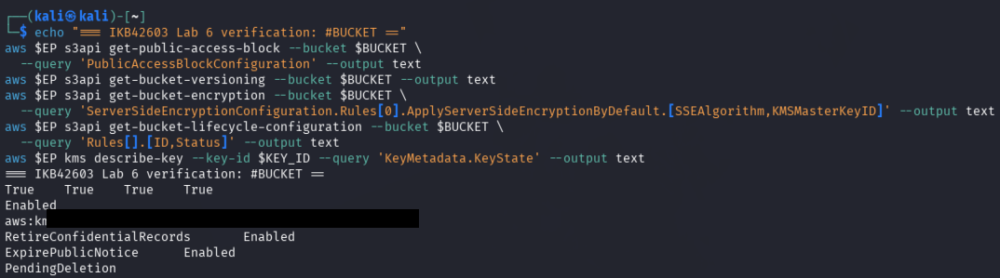

Three high-value audit artefacts are:

1. `get-public-access-block` — proves the preventative public-access guardrail is configured.
2. `get-bucket-encryption` (and `head-object`) — proves the bucket default and object use of SSE-KMS.
3. `get-bucket-lifecycle-configuration` and `kms describe-key` — prove retention policy and the cryptographic-erasure state.

## Short-Answer Questions

### 1. Which single element of the Task 2 policy caused the exposure, and why is `Principal: "*"` more dangerous on a bucket policy than an over-broad IAM policy attached to one user?

`"Principal": "*"` caused the exposure. In a bucket policy, it names every principal, including unauthenticated internet users, so anyone who knows or guesses the object URL can request it. An over-broad IAM policy is dangerous but is normally limited to the particular user, group, or role to which it is attached. The bucket-policy wildcard removes that identity boundary.

### 2. Explain the difference between an identity-based policy and a resource-based policy. In Task 4, which one decided each analyst request?

An identity-based policy is attached to an IAM identity and states what that caller may do. A resource-based policy is attached to the resource, here the S3 bucket, and states which principals may or may not access it. The analyst’s internal read was permitted by the IAM allow and the bucket-policy `AllowAnalystInternal` statement. The confidential read was decided by the bucket-policy `DenyAnalystConfidential` statement; its explicit deny overrode the IAM allow.

### 3. Why is Block Public Access a guardrail, and why does that matter in an organisation with many engineers?

BPA is a preventative guardrail because it stops public policies or ACLs from being effective, even if an engineer attempts to apply one. A detective control, such as an alert or periodic report, finds the unsafe bucket only after the configuration has been deployed and may already have exposed data. At scale, guardrails reduce dependence on every individual making a perfect decision every time.

### 4. Does default SSE-KMS protect the confidential record from the analyst in Task 4?

Not by itself. SSE-KMS encrypts object data while stored and decrypts it transparently for a caller who is authorised by S3 and KMS. It protects against unauthorised access to stored media and supports key governance, but it does not prevent an authorised S3 caller from receiving plaintext. The explicit bucket-policy deny, least privilege, and appropriate KMS permissions protect the record from the analyst.

### 5. Why is `delete-object` alone not compliant with a right-to-erasure request, and which two mechanisms make deletion provable?

With versioning enabled, `delete-object` adds a delete marker but leaves prior versions, including the original sensitive record, recoverable by version ID. Two mechanisms are: (1) enumerate and permanently delete every object version and delete marker by its version ID; and (2) cryptographic erasure, by disabling and scheduling deletion of the KMS key that encrypts the relevant objects. Lifecycle rules can automate the first mechanism according to a documented retention schedule.

## Challenges Encountered

- LocalStack stored BPA configuration but did not enforce it, so the reintroduced public policy and anonymous read still succeeded. The actual configuration was captured and the expected AWS enforcement is documented.
- LocalStack accepted the presigned URL after its intended expiry. The report instead verifies the expiry value and signature semantics, which production AWS validates.
- The HTTP LocalStack endpoint made `aws:SecureTransport=false`, intentionally demonstrating that a sound production policy can lock out an insecure test endpoint.

## Lessons Learned

- Classification and prefix scoping must precede access-control design.
- One resource-policy wildcard can create an internet-facing breach; BPA is essential as a preventative organisational guardrail.
- Explicit deny overrides identity and resource allows.
- Encryption at rest is not access control; it must be combined with least privilege and key governance.
- A delete marker is not deletion. Version management, lifecycle rules, and cryptographic erasure are necessary for defensible data retirement.

## References

1. Amazon Web Services. (n.d.). *Amazon S3 security best practices*. https://docs.aws.amazon.com/AmazonS3/latest/userguide/security-best-practices.html
2. Amazon Web Services. (n.d.). *Using versioning in S3 buckets*. https://docs.aws.amazon.com/AmazonS3/latest/userguide/Versioning.html
3. Amazon Web Services. (n.d.). *Protecting data with server-side encryption using AWS KMS keys (SSE-KMS)*. https://docs.aws.amazon.com/AmazonS3/latest/userguide/UsingKMSEncryption.html
4. Amazon Web Services. (n.d.). *Sharing objects with presigned URLs*. https://docs.aws.amazon.com/AmazonS3/latest/userguide/ShareObjectPreSignedURL.html
5. LocalStack. (n.d.). *Service feature coverage*. https://docs.localstack.cloud/references/coverage/
6. Cloud Security Alliance. (2024). *Security guidance for cloud computing v5.0: Domain 5, data security*. https://cloudsecurityalliance.org/artifacts/security-guidance-v5
